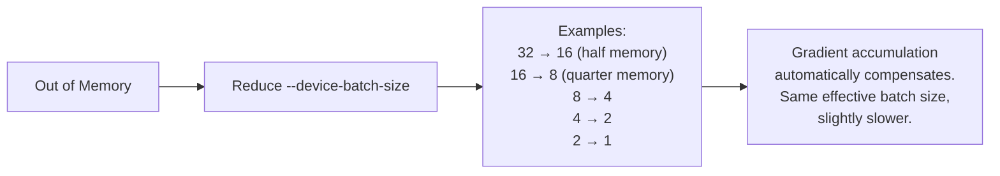
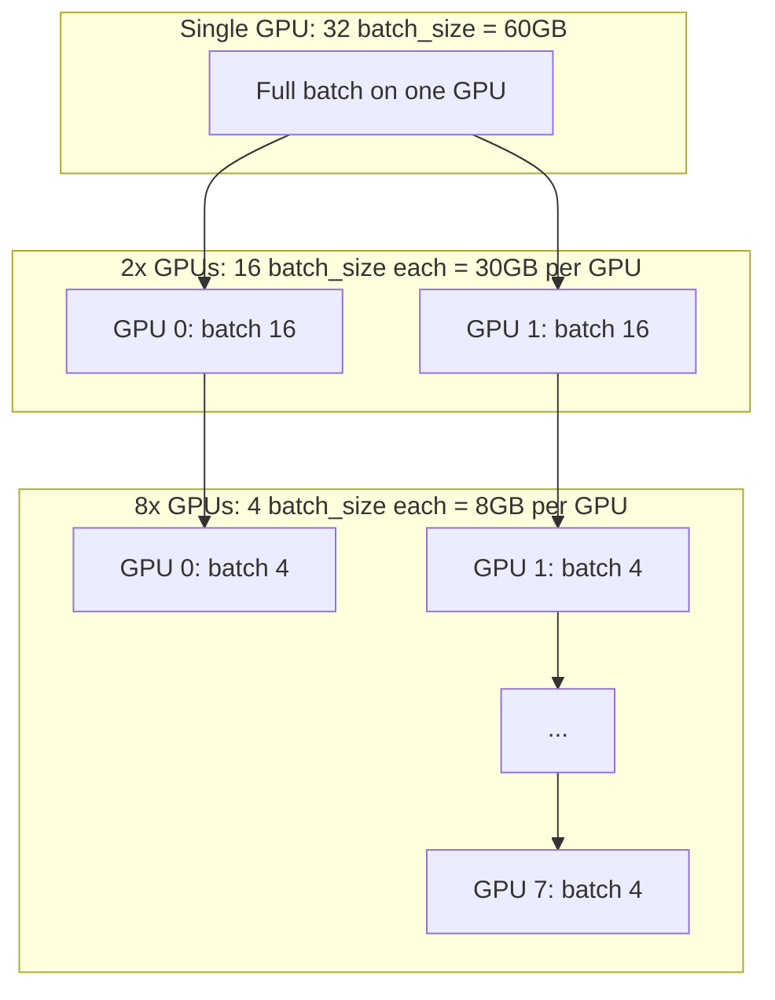
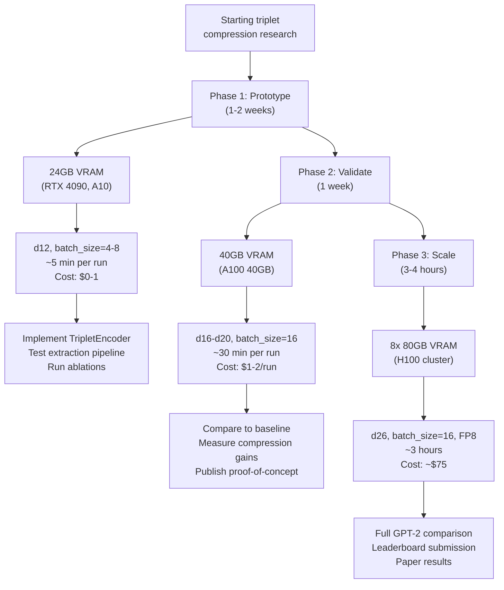

# nanochat VRAM Requirements Guide


> **Quick answer:** For the full GPT-2 speedrun, you need **8x H100 (80GB each)** or equivalent. For quick experiments (d12), **24GB VRAM** is enough. For triplet compression research, **40GB VRAM** gives you good flexibility.


---


## Memory Breakdown by Model Size


| Model | Params | Model Weights | Optimizer State | Activations* | Total Memory |
|---|---|---|---|---|---|
| **d4** (tiny) | 79M | 0.16 GB | 0.63 GB | 0.05 GB | **~1 GB** |
| **d12** (GPT-1) | 135M | 0.27 GB | 1.08 GB | 2.42 GB | **~4 GB** |
| **d20** (small) | 192M | 0.38 GB | 1.54 GB | 8.05 GB | **~10 GB** |
| **d24** (GPT-2-ish) | 220M | 0.44 GB | 1.76 GB | 9.66 GB | **~12 GB** |
| **d26** (speedrun, FP8) | 234M | 0.23 GB | 1.87 GB | 2.62 GB | **~5 GB** |


*Activations at batch_size=32 for d12/d20/d24, batch_size=16 for d26 (with FP8)


---


## GPU Tiers and What You Can Do

```mermaid
graph TD
   subgraph "16GB VRAM (RTX 4080, RTX 3090)"
       T1["d4-d8 models<br/>batch_size=1-2"]
       T1_USE["Use case: Toy experiments,<br/>architecture validation"]
   end


   subgraph "24GB VRAM (RTX 4090, RTX 3090 Ti, A10)"
       T2["d12 (GPT-1 scale)<br/>batch_size=4-8"]
       T2_USE["Use case: Quick experiments<br/>(~5 min runs), ablations"]
   end


   subgraph "40GB VRAM (A100 40GB)"
       T3["d12-d16<br/>batch_size=16-32"]
       T3_USE["Use case: Serious research,<br/>triplet compression dev"]
   end


   subgraph "80GB VRAM (A100 80GB, H100)"
       T4["d20-d26<br/>batch_size=16-32"]
       T4_USE["Use case: Full GPT-2 training,<br/>leaderboard submissions"]
   end


   T1 --> T1_USE
   T2 --> T2_USE
   T3 --> T3_USE
   T4 --> T4_USE
```





---


## Recommended Configurations


### 1. Consumer GPU (RTX 4090, 24GB)


**Best model: d12 with batch_size=4**


```bash
# Quick 5-minute experiment
python -m scripts.base_train \
   --depth=12 \
   --device-batch-size=4 \
   --run="d12_experiment" \
   --core-metric-every=999999 \
   --save-every=-1
```


**Memory usage:** ~6-8 GB
**Training time:** ~5 minutes to convergence
**Cost:** You own the GPU, so $0
**Good for:**
- Testing triplet compression architecture changes
- Rapid iteration on ideas
- Learning the codebase


---


### 2. Single A100 40GB


**Best model: d16 with batch_size=16**


```bash
python -m scripts.base_train \
   --depth=16 \
   --device-batch-size=16 \
   --run="d16_experiment"
```


**Memory usage:** ~30-35 GB
**Training time:** ~20-30 minutes to convergence
**Cost:** ~$1-2/hour on cloud providers
**Good for:**
- Serious research experiments
- Validating ideas before scaling up
- Triplet compression proof-of-concept


---


### 3. Single A100 80GB or H100


**Best model: d20-d24 with batch_size=32**


```bash
python -m scripts.base_train \
   --depth=20 \
   --device-batch-size=32 \
   --run="d20_experiment"
```


**Memory usage:** ~50-60 GB
**Training time:** ~1-2 hours to convergence
**Cost:** ~$2-3/hour (A100) or ~$3-4/hour (H100)
**Good for:**
- Near-GPT-2 capability
- Pre-publication validation
- Single-GPU alternative to multi-GPU speedrun


---


### 4. 8x H100 80GB (The Speedrun Config)


**Model: d26 with batch_size=16, FP8**


```bash
# From runs/speedrun.sh
OMP_NUM_THREADS=1 torchrun --standalone --nproc_per_node=8 \
   -m scripts.base_train -- \
   --depth=26 \
   --device-batch-size=16 \
   --fp8 \
   --target-param-data-ratio=8.5 \
   --run=speedrun
```


**Memory usage per GPU:** ~30-40 GB (FP8 reduces memory)
**Total cluster memory:** 640 GB
**Training time:** ~2.9 hours (current leaderboard record)
**Cost:** ~$70-75
**Good for:**
- Leaderboard submissions
- Full GPT-2 capability
- Publication-quality results


---


## Memory Scaling Strategies


### Strategy 1: Reduce Batch Size (Easiest)





**Command:**
```bash
# Instead of default batch_size=32
python -m scripts.base_train --depth=12 --device-batch-size=8
```


**Trade-off:**
- ✅ Uses 4x less memory
- ❌ ~10-20% slower (more gradient accumulation steps)
- ✅ **Results are identical** (same effective batch size maintained)


---


### Strategy 2: Use FP8 (Requires H100)


FP8 training cuts memory usage roughly in half:


```bash
python -m scripts.base_train \
   --depth=26 \
   --fp8 \
   --device-batch-size=16
```


**Requirements:**
- ✅ Hopper architecture GPU (H100, not A100)
- ✅ `torchao` library (included in nanochat)


**Benefits:**
- ~2x less memory for activations
- ~5% faster training (recent leaderboard improvement)
- Same final model quality


---


### Strategy 3: Multi-GPU (Splits Batch Across GPUs)





**Command:**
```bash
# 2 GPUs (halves memory per GPU)
torchrun --nproc_per_node=2 -m scripts.base_train -- --depth=20 --device-batch-size=16


# 8 GPUs (1/8th memory per GPU, 8x faster)
torchrun --nproc_per_node=8 -m scripts.base_train -- --depth=26 --device-batch-size=4
```


**Benefits:**
- Splits memory load across GPUs
- Faster training (near-linear scaling)
- Can train larger models


---


## Triplet Compression Memory Impact


Adding triplet context will **increase memory slightly**, but not dramatically:


### Baseline (no triplets)
```
Attention: batch_size × seq_len × d_model
        = 32 × 2048 × 768
        = 50M elements × 2 bytes = 100 MB
```


### With 100 triplets prepended
```
Attention: batch_size × (100 triplets + 1500 tokens) × d_model
        = 32 × 1600 × 768
        = 39M elements × 2 bytes = 78 MB


Triplet encoding: batch_size × 100 × (3 embeddings)
               = 32 × 100 × 3 × 768 × 2 bytes
               = ~15 MB
```


**Net effect:** ~10-15% memory overhead for triplet context. Negligible compared to optimizer states and gradients.


**Recommendation:** If you can run d12 without triplets, you can run d12 with triplets. Just reduce batch size by 10-20% to be safe.


---


## Common OOM (Out of Memory) Errors


### Error: "CUDA out of memory"


**Fix 1 — Reduce batch size:**
```bash
# Change from --device-batch-size=32 to:
--device-batch-size=16  # Try first
--device-batch-size=8   # If still OOM
--device-batch-size=4   # If desperate
```


**Fix 2 — Reduce sequence length:**
```bash
# Change from default 2048 to:
--max-seq-len=1024  # Half the memory for activations
```


**Fix 3 — Reduce model depth:**
```bash
# Instead of --depth=20, try:
--depth=16  # or
--depth=12
```


---


### Error: "RuntimeError: Trying to backward through the graph a second time"


This is **not** a memory error. It's a gradient bug. Check your code for double `.backward()` calls.


---


### Error: "DefaultCPUAllocator: not enough memory"


You're running out of **RAM**, not VRAM. This happens during data loading.


**Fix:**
```bash
# Reduce the number of data loading workers (in dataloader.py)
# Or reduce the amount of data cached in memory
```


---


## Cost Comparison


| Configuration | VRAM | Training Time (d12) | Cost per Run | Use Case |
|---|---|---|---|---|
| RTX 4090 (owned) | 24GB | ~10 min | $0 | Learning, rapid iteration |
| 1x A100 40GB | 40GB | ~5 min | ~$0.10 | Quick experiments |
| 1x A100 80GB | 80GB | ~5 min | ~$0.15 | Larger experiments |
| 1x H100 | 80GB | ~3 min | ~$0.20 | Fast iteration |
| 8x H100 (speedrun) | 640GB | ~2.9 hours | ~$73 | GPT-2 capability |


For triplet compression research:
- **Prototyping:** Use a consumer GPU (RTX 4090) or single A100 40GB
- **Validation:** Run on 1-2x A100 80GB
- **Final results:** Scale to 8x H100 for GPT-2 comparison


---


## Recommendations for Your Triplet Project





**Budget estimate for full research project:**
- Prototyping (d12, 100 runs): $0-100
- Validation (d16-d20, 20 runs): $20-40
- Final scaling (d26, 3 runs): $225
- **Total: ~$250-350** for a complete research project from idea to publication


Compare this to fine-tuning SmolLM: similar cost, but you'd spend weeks fighting HuggingFace instead of days implementing your idea.


---


## Summary


| Your GPU | What You Can Do | Memory Strategy |
|---|---|---|
| **16GB** (RTX 3090, 4080) | d4-d8, toy experiments | batch_size=1-2 |
| **24GB** (RTX 4090, A10) | d12 quick experiments (5 min) | batch_size=4-8 ← **Start here** |
| **40GB** (A100 40GB) | d16-d20 serious research | batch_size=16 ← **Validate here** |
| **80GB** (A100 80GB, H100) | d20-d24 near-GPT-2 | batch_size=32 |
| **8x 80GB** (H100 cluster) | d26 full speedrun, GPT-2 | batch_size=16 + FP8 ← **Scale here** |


**For triplet compression:** Start with 24GB (d12), validate with 40GB (d16-d20), scale to 8x80GB (d26) for final results.


