# Starting Point: nanochat vs SmolLM Fine-tuning


> **TL;DR:** For triplet context compression research, **start with nanochat**. You need control over the forward pass, data loading, and attention mechanism — all of which are locked behind HuggingFace abstractions in SmolLM. nanochat is 7.4K lines of hackable PyTorch; SmolLM is a 1.7B pre-trained checkpoint you'd integrate with transformers library boilerplate.


---


# Triplet Context Compression: Structured Memory for Transformers


> **Status:** Proposal / Early Research
> **Applies to:** nanochat GPT architecture (`nanochat/gpt.py`)
> **Core claim:** Replace raw token history with knowledge graph triplets as a structured, compressed context window — giving the model 3-40x more effective context at the same compute cost.


---


## 1. The Problem with Raw Token Context


Every transformer today burns its entire attention budget on raw tokens. A 2048-token context window in nanochat stores *everything* — function words, punctuation, repeated phrases, filler — with equal weight.


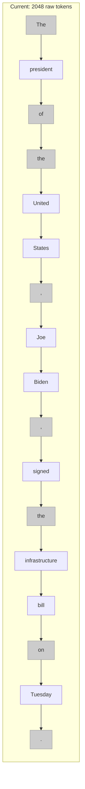


8 out of 17 tokens (the grey ones) carry near-zero semantic content. They're syntactic scaffolding. The model spends attention on "the", ",", and "." when what actually matters is: **Biden signed the infrastructure bill on Tuesday**.


Now multiply this waste across 2048 positions. At best, half the context window holds real information. The rest is structural noise.


---


## 2. The Idea: Triplets as Compressed Memory


What if older context was stored not as raw tokens, but as knowledge graph triplets?


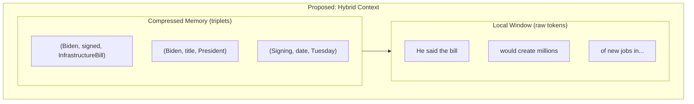


The model keeps a **short raw token window** (last 512-1024 tokens) for syntactic coherence and local context. Everything older gets **extracted into triplets** — a structured, compressed representation that preserves facts while discarding filler.


3 triplets replace 17 tokens. That's a **5.7x compression** on a single sentence. On longer passages, the ratio climbs to **20-40x**.


---


## 3. Architecture


### 3.1 The Two-Zone Attention Window


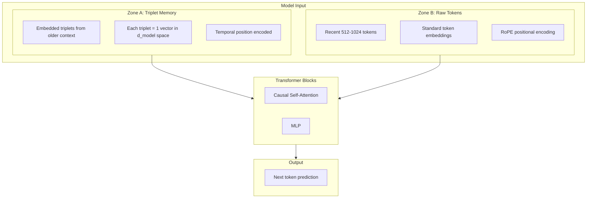


**Attention rules:**
- Raw tokens attend to **both** triplets and other raw tokens (causal)
- Triplets are **read-only** — they don't attend to raw tokens (they're finalized summaries)
- Triplets attend to each other (entity relationships across the memory)


### 3.2 How Triplets Enter the Model


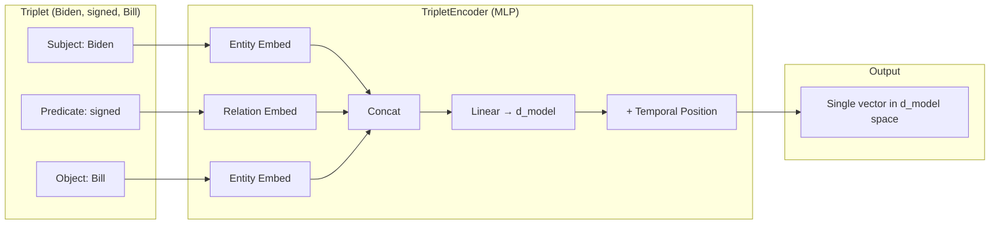


Each triplet becomes **one position** in the attention window. A vocabulary of entities and relations is learned alongside the token vocabulary. The temporal position tells the model *when* in the conversation this fact was established — critical for tracking state changes ("Biden signed" at time T, "Biden vetoed" at time T+500).


### 3.3 Integration with nanochat's GPT


The change to `gpt.py` forward pass is minimal:


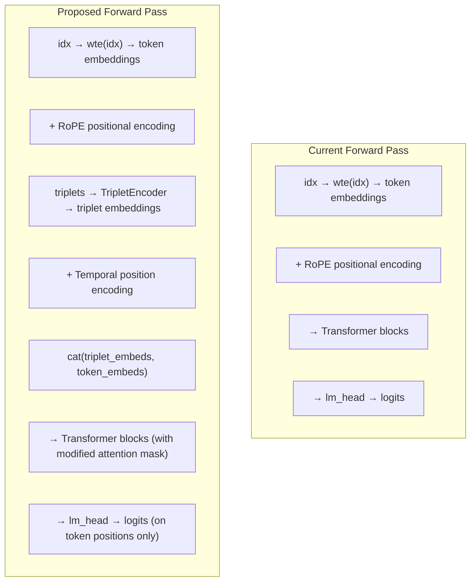


The loss function, optimizer, and training loop stay **unchanged**. The model still does next-token prediction. It just has a richer, more structured context to predict from.


---


## 4. The Compression Advantage


### 4.1 Concrete Examples


**Example 1: Legal Document**


A 2048-token legal passage about a contract dispute:


```
Raw tokens: 2048 positions consumed
Key facts: ~12 (parties, dates, clauses, amounts, rulings)
```


As triplets:
```
(AliceCorp, sued, BobLLC)
(Lawsuit, filed_on, 2024-03-15)
(Contract, value, $2.4M)
(AliceCorp, claims, BreachOfContract)
(Clause7, requires, DeliveryBy2024-01)
(BobLLC, delivered_on, 2024-03-01)
(BobLLC, defense, ForceMajeure)
(Judge, ruled, InFavorOfAlice)
(Damages, amount, $800K)
(BobLLC, must_pay_by, 2024-12-31)
(AliceCorp, represented_by, SmithLaw)
(BobLLC, represented_by, JonesLLP)
```


**12 triplets = 12 positions. Compression: 170x.**


The model now has the remaining ~2036 positions for fresh raw tokens. Effective context: the information content of **~4000 raw tokens** in the space of 2048.


**Example 2: Multi-turn Conversation**


```
User: I'm working on a Python web app using FastAPI. The database is PostgreSQL.
     I need help with the authentication system. We're using JWT tokens.
     The frontend is React. Deployment is on AWS ECS.


[... 6 more turns discussing implementation details ...]
```


After 8 turns (~1500 tokens consumed), the triplet memory contains:


```
(Project, language, Python)
(Project, framework, FastAPI)
(Project, database, PostgreSQL)
(Project, auth_method, JWT)
(Project, frontend, React)
(Project, deployment, AWS_ECS)
(Auth, status, InProgress)
(User, needs_help_with, TokenRefresh)
```


**8 triplets instead of ~1500 tokens. Compression: 187x.**


Every future turn can reference "the project uses FastAPI" without re-reading 1500 tokens of conversation history. The model knows the full project context in 8 attention positions.


**Example 3: Story/Narrative (worst case)**


```
"The old man sat by the window, watching the rain trace paths
down the glass like tears on a weathered face."
```


As triplets:
```
(OldMan, action, Sitting)
(OldMan, location, ByWindow)
(Rain, action, Falling)
```


**Compression: ~5x — but the soul of the sentence is lost.** The simile, the mood, the imagery — gone. This is where triplet compression is weakest. The model would need the raw tokens for any literary, stylistic, or emotional content.


This is why the **two-zone design is essential** — raw tokens for what's recent and nuanced, triplets for what's older and factual.


---


### 4.2 Effective Context Scaling


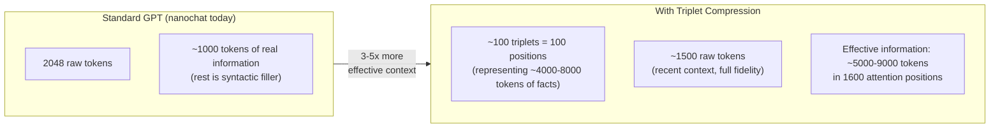


The attention cost stays roughly the same (similar number of positions), but the **information bandwidth** of the context window multiplies.


---


## 5. How It Compares


### 5.1 vs. Longer Context Windows


The brute-force alternative: just make the context longer (4096, 8192, 128K tokens).


```mermaid
graph TB
   subgraph APPROACH_A["Approach: Longer Context"]
       A1["4x context = 16x attention cost (quadratic)"]
       A2["All tokens treated equally"]
       A3["Model must learn to ignore filler"]
       A4["Needle-in-haystack: exact token is there"]
       A5["No information loss"]
   end


   subgraph APPROACH_B["Approach: Triplet Compression"]
       B1["Same attention cost as 2048 context"]
       B2["Filler eliminated at compression stage"]
       B3["Model attends to pre-extracted facts"]
       B4["Needle-in-haystack: depends on extractor quality"]
       B5["Lossy — style and nuance discarded"]
   end
```


Longer context is better when you need verbatim recall ("what was the exact wording?"). Triplet compression is better when you need **factual reasoning over large spans** ("what did the user say about authentication three pages ago?").


The key insight: **most real tasks need facts, not verbatim recall.** Coding assistance, Q&A, analysis, conversation — these are all fact-retrieval problems where triplet compression should win.


### 5.2 vs. Existing Memory Compression Approaches


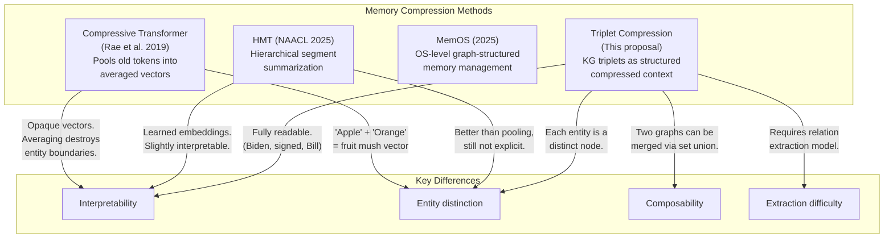


**The core advantage over pooling/averaging:** triplets maintain **entity boundaries**. If the context mentions both Alice and Bob with different attributes, a pooled vector blurs them together. Triplets keep `(Alice, role, Engineer)` and `(Bob, role, Designer)` as distinct, addressable facts.


**The core advantage over learned memory embeddings:** triplets are **interpretable and debuggable**. When the model gets something wrong, you can inspect the triplet memory and see exactly what information it had available. With opaque embeddings, you can't.


---


## 6. The Extraction Pipeline


This is the hardest engineering challenge. The quality of the entire system depends on the triplet extractor.


### 6.1 Three Extraction Strategies


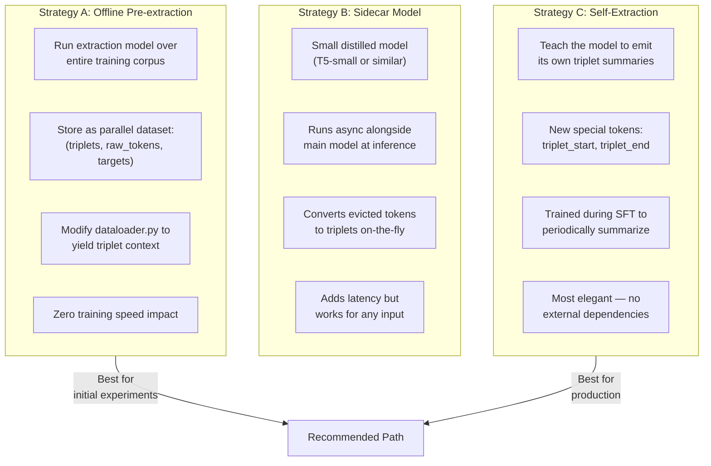


**Strategy A** is the right starting point. It's the least risky and lets you test whether the model actually benefits from triplet context before investing in live extraction.


**Strategy C** is the most exciting long-term. nanochat already has tool-use tokens (`<|python_start|>`, `<|output_start|>` in `tokenizer.py`). Adding `<|triplet_start|>` / `<|triplet_end|>` follows the same pattern. The model learns to emit structured summaries of its own context — a form of **learned, structured self-compression**.


### 6.2 Handling the Hard Cases


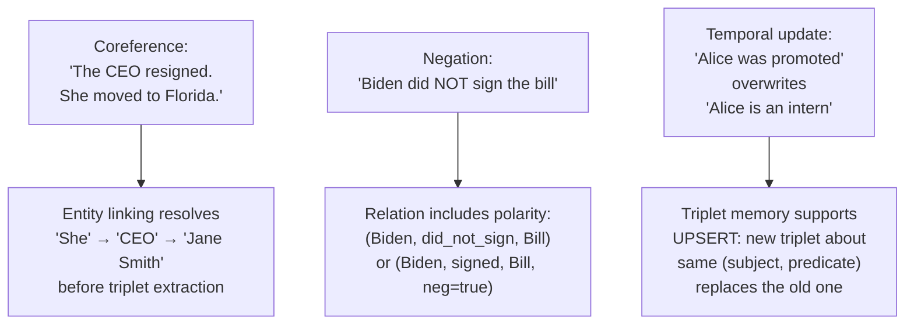


These are real challenges, but they're **solvable engineering problems**, not fundamental blockers. Coreference resolution, negation handling, and temporal updates are all active research areas with working solutions.


---


## 7. Implementation Plan for nanochat


### 7.1 Four Incremental Steps


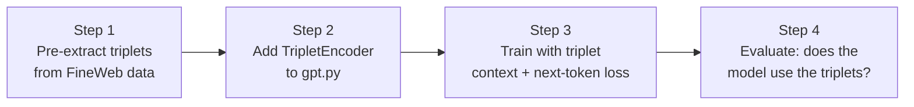


**Step 1 — Data preparation.** Run an off-the-shelf relation extraction model (e.g., REBEL, or a prompted LLM) over the FineWeb training data. For each document, produce a parallel file of extracted triplets. Store alongside the existing parquet shards.


**Step 2 — Model changes.** Add to `gpt.py`:
- An entity/relation vocabulary and embedding table
- A `TripletEncoder` MLP: `(e_subj, e_rel, e_obj) → d_model`
- A temporal position encoding for triplets
- Modified forward pass: prepend triplet embeddings before token embeddings
- An attention mask that lets tokens attend to triplets but not vice versa


**Step 3 — Training.** Modify `dataloader.py` to yield `(triplets, input_tokens, target_tokens)`. Modify `base_train.py` to pass triplets through the encoder and concatenate. Loss function stays **identical** — cross-entropy next-token prediction. The model learns to leverage triplet context through gradient signal alone.


**Step 4 — Validation.** Run ablations:
- Does masking out triplets increase perplexity? (If not, the model ignores them — stop here.)
- Does providing more triplets from further back improve performance?
- Compare CORE eval scores with and without triplet context.
- Compare against a baseline with equivalent raw-token context length.


### 7.2 What Changes, What Doesn't


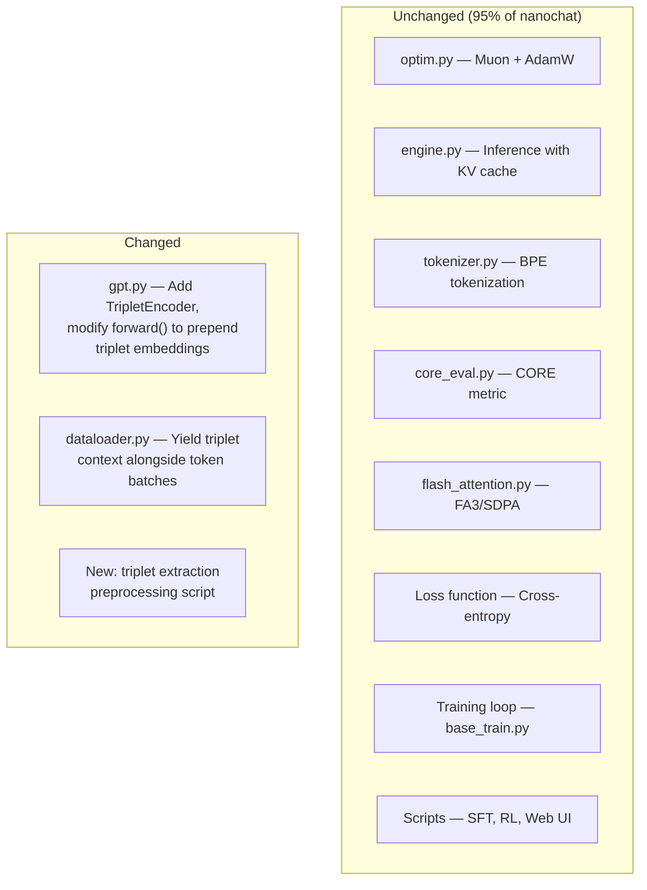


The change is **surgical**. The transformer architecture, optimizer, loss, evaluation — all untouched. You're adding a new input pathway, not redesigning the model.


---


## 8. Why This Could Matter


### 8.1 The Scaling Argument


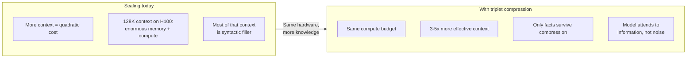


The current path to longer context is brute force: more positions, more memory, more FLOPs. Triplet compression offers an alternative scaling axis — **compress the information, not expand the compute**. A model with 2048 positions and triplet compression could carry the factual bandwidth of an 8K-context model at a fraction of the cost.


### 8.2 The Interpretability Win


Every other compression method (pooling, learned embeddings, KV cache eviction) produces opaque vectors. You cannot look at a compressed memory slot and say "this represents the fact that Alice is an engineer."


With triplets, you can. The model's memory is a readable, debuggable knowledge graph. When the model makes a mistake, you check the triplets: was the fact there? Was it extracted correctly? Was the temporal position right? This is **mechanistic interpretability for free**.


### 8.3 The Composability Win


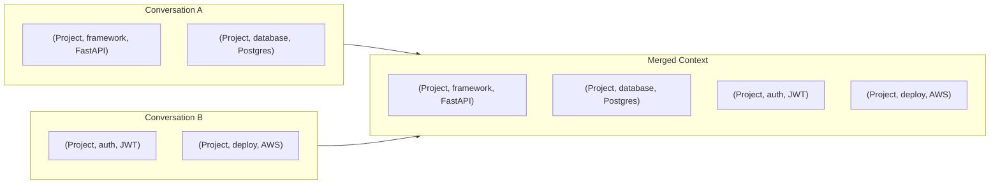


Merging context from two conversations is a **set union on triplets**. No re-encoding, no re-embedding, no re-training. You can build persistent user profiles, project contexts, or knowledge bases that carry across sessions — something raw token context fundamentally cannot do.


---


## 9. Risks and Honest Limitations


| Risk | Severity | Mitigation |
|---|---|---|
| Triplet extraction quality is poor | **High** | Start with offline pre-extraction using best available models. Measure extraction accuracy before training. |
| Model ignores triplet context entirely | **Medium** | Ablation in Step 4 catches this early. If triplets don't reduce perplexity, stop. |
| Coreference errors fragment the graph | **Medium** | Use coreference resolution as a preprocessing step. Accept some fragmentation — the model can still learn from imperfect triplets. |
| Loss of stylistic/emotional content | **Low (by design)** | Raw token window handles this. Triplets only compress *older* context where facts matter more than style. |
| Flash Attention incompatibility | **Low** | Triplets are prepended as regular positions. The attention mask is a simple block-causal structure, fully compatible with FA3. |
| Schema drift across long contexts | **Medium** | Normalize entity and relation names during extraction. Use canonical forms. |


The biggest risk is extraction quality. If the extractor produces garbage triplets, the model learns to ignore them, and you've gained nothing. **This is why offline pre-extraction and ablation testing (Steps 1 and 4) come first** — you validate the idea cheaply before committing to architecture changes.


---


## 10. Summary


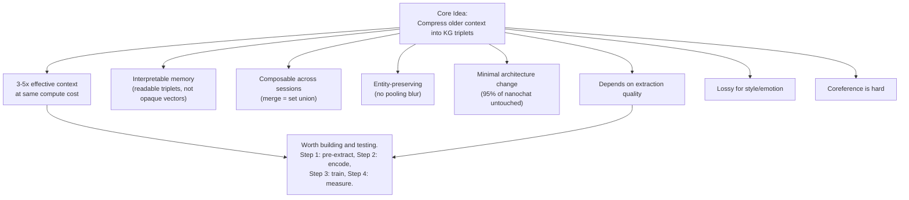


This is not a moonshot. It's a **tractable, incremental experiment** that can be validated or killed in a single training run. The potential upside — 3-5x effective context with interpretable, composable memory — justifies the engineering investment of modifying two files and preprocessing one dataset.


The model stays a language model. It still trains on text. It still predicts tokens. It just remembers better.


---


## References


- Rae et al., "Compressive Transformers for Long-Range Sequence Modelling" (2019) — [arxiv.org/abs/1911.05507](https://arxiv.org/abs/1911.05507)
- KnowFormer: Transformers for Knowledge Graph Reasoning (2024) — [arxiv.org/html/2409.12865v1](https://arxiv.org/html/2409.12865v1)
- iHT: Pre-training Transformers for KG Completion (2023) — [arxiv.org/abs/2303.15682](https://arxiv.org/abs/2303.15682)
- TGformer: Graph Transformer for KG Embedding (IEEE, 2026) — [ieeexplore.ieee.org/document/10742302](https://ieeexplore.ieee.org/document/10742302/)
- HMT: Hierarchical Memory Transformer (NAACL 2025) — [aclanthology.org/2025.naacl-long.410](https://aclanthology.org/2025.naacl-long.410.pdf)
- MemOS: A Memory Operating System for AI (2025) — [memtensor.com.cn/files/MemOS_0707](https://statics.memtensor.com.cn/files/MemOS_0707.pdf)
- APE: Context Compression with Attention (ICLR 2025)
- Language Modeling Is Compression (ICLR 2024)
- Graphormer: Do Transformers Really Perform Bad for Graph Representation? (2021) — [arxiv.org/abs/2106.05234](https://arxiv.org/abs/2106.05234)


