# Starting Point: nanochat vs SmolLM Fine-tuning


> **TL;DR:** For triplet context compression research, **start with nanochat**. You need control over the forward pass, data loading, and attention mechanism — all of which are locked behind HuggingFace abstractions in SmolLM. nanochat is 7.4K lines of hackable PyTorch; SmolLM is a 1.7B pre-trained checkpoint you'd integrate with transformers library boilerplate.


---


## The Question


Should you:
1. **Start from nanochat** — train from scratch with a custom architecture
2. **Fine-tune SmolLM** — adapt an existing pre-trained model


For triplet context compression, this choice determines whether your idea is even *implementable*.


---


## Quick Comparison Table


| Dimension | nanochat | SmolLM |
|---|---|---|
| **Model size** | 12-26 layers, 60M-400M params (configurable) | 135M / 360M / 1.7B (fixed checkpoints) |
| **Training data** | ~600B tokens (FineWeb-Edu, customizable) | 600B-1T tokens (pre-trained on SmolLM-Corpus) |
| **Architecture access** | Full control — 454 lines in `gpt.py` | Black box — HuggingFace Transformers API |
| **Data loading** | Custom `dataloader.py` — you control packing | HuggingFace datasets — standard collators |
| **Forward pass** | Modify `gpt.py:388` directly | Override `forward()` in a wrapper model |
| **Attention mechanism** | Flash Attention 3 + SDPA, sliding window | Standard Transformers attention (GQA) |
| **Training cost** | $73 (3 hours, 8xH100) for GPT-2 capability | $0 (already trained) + fine-tuning cost |
| **Code size** | 7,400 lines, all visible | Transformers library (~200K lines) + your wrapper |
| **Hackability** | **Extreme** — designed for research | **Low** — library abstractions everywhere |
| **Deployment** | Web UI, CLI, engine.py inference | Transformers `model.generate()` |
| **Community** | Active leaderboard, Discord, research-focused | HuggingFace ecosystem, production-focused |


---


## The Core Issue: Architecture Modifications


Triplet context compression requires **three fundamental changes**:


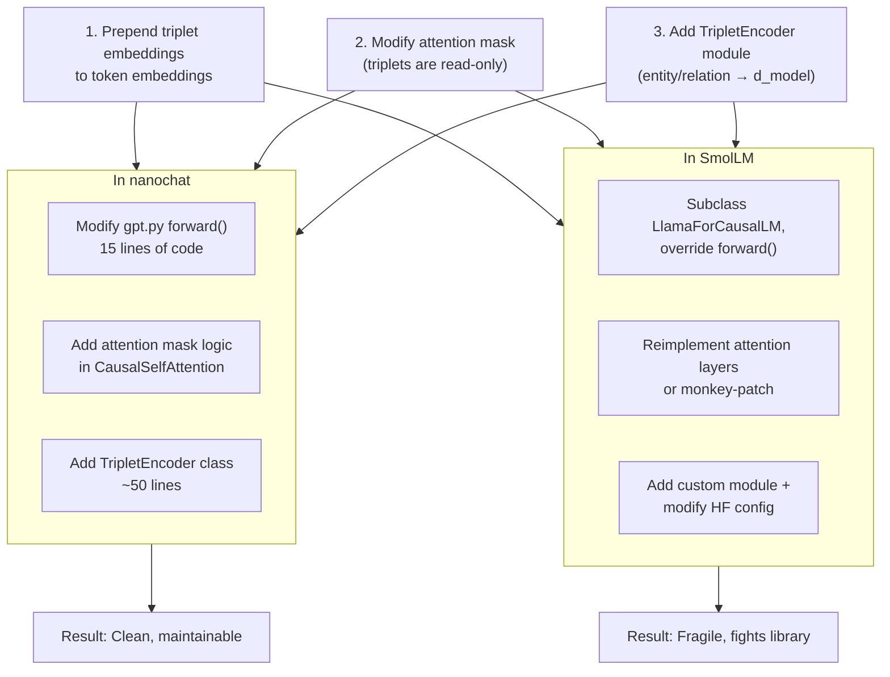


### In nanochat (easy):


```python
# nanochat/gpt.py, line ~388
def forward(self, idx, triplets=None):
   x = self.transformer.wte(idx)  # token embeddings


   if triplets is not None:
       # NEW: encode and prepend triplets
       triplet_embeds = self.triplet_encoder(triplets)
       x = torch.cat([triplet_embeds, x], dim=1)


   for block in self.transformer.h:
       x = block(x)


   # Only compute logits on token positions, not triplets
   x = x[:, -idx.size(1):, :]
   logits = self.lm_head(x)
   return logits
```


You own the code. The forward pass is 30 lines of readable PyTorch. You add 5 lines, done.


### In SmolLM (painful):


```python
# You have to subclass and fight the library
from transformers import LlamaForCausalLM


class SmolLMWithTriplets(LlamaForCausalLM):
   def __init__(self, config):
       super().__init__(config)
       self.triplet_encoder = TripletEncoder(config)


   def forward(self, input_ids, triplets=None, **kwargs):
       # Now you're overriding a 200-line HuggingFace method
       # that handles: attention_mask, position_ids, past_key_values,
       # use_cache, output_attentions, output_hidden_states, return_dict...


       # You have to manually replicate all of that logic
       # while injecting your triplet embeddings
       # AND you break every HuggingFace utility (Trainer, generate(), etc.)
```


The HuggingFace `forward()` is designed for *users*, not *researchers*. It's a high-level API that hides the embedding layer, attention mechanism, and positional encoding. You'd need to:


1. Copy-paste the entire `LlamaModel.forward()` method
2. Modify the embedding step
3. Hope the internal state (position IDs, cache, masks) still works
4. Lose compatibility with HuggingFace Trainer, generation utilities, quantization, etc.


It's technically possible, but you're **fighting the library**. Every HuggingFace update could break your code.


---


## Training Cost Reality Check


**nanochat:**
- GPT-2 capability (0.2578 CORE): **$73** (3 hours, 8xH100)
- d12 quick experiment: **~$2** (5 minutes, 8xH100)
- d20 small model: **~$10** (30 minutes, 8xH100)


**SmolLM fine-tuning:**
- Assuming 10B tokens of SFT data (standard): **~$20-40** (1-2 hours, 8xH100)
- But you're constrained to SmolLM's architecture — no triplet compression


The cost difference is **not significant**. $73 vs $0+fine-tuning cost is a rounding error in research budgets. The real cost is **engineering time**: weeks fighting HuggingFace vs hours modifying clean PyTorch.


---


## When SmolLM Would Be Better


SmolLM is the right choice if:


1. **You don't need architecture changes.** You're just fine-tuning on domain data.
2. **You want production deployment today.** HuggingFace ecosystem = ONNX, GGUF, llama.cpp, WebGPU out of the box.
3. **You value pre-trained knowledge.** SmolLM already knows Python, reasoning, world facts — you're adding, not replacing.
4. **You're not doing research.** You're building an app and want the fastest path to a working chatbot.


But for triplet context compression, **none of these apply**. You're doing novel architecture research. You need to modify the forward pass, data loading, and attention. Pre-trained knowledge doesn't help (you're changing how context works, so the model needs to relearn context usage anyway).


---


## The nanochat Advantages for This Project


### 1. Data Loading Control


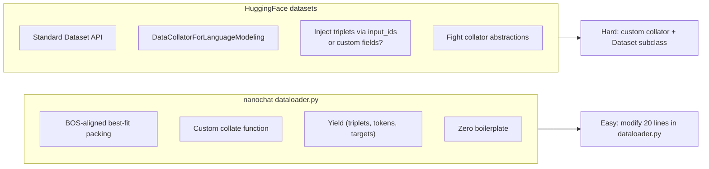


nanochat's `dataloader.py` is 165 lines. You control the exact format of every batch. Adding `triplets` to the batch is trivial.


HuggingFace datasets assume `input_ids` and `labels`. Adding structured triplet data requires custom collators, non-standard fields, and careful handling to avoid breaking Trainer.


### 2. Transparent Attention


nanochat uses **Flash Attention 3** with an explicit causal mask. You can see and modify exactly what each token attends to.


```python
# nanochat/gpt.py, CausalSelfAttention
y = flash_attn_func(
   q, k, v,
   causal=True,
   window_size=(self.window_size, 0) if self.window_size else (-1, -1)
)
```


Want triplets to be read-only? Add a custom mask:


```python
# Triplets are positions 0:num_triplets
# Tokens are positions num_triplets:end
# Create a block-causal mask: tokens attend to triplets + previous tokens
```


In SmolLM, attention is buried in `LlamaAttention` with position embeddings, caching, and GQA logic intertwined. Modifying the mask means rewriting the entire attention layer.


### 3. Experiment Velocity


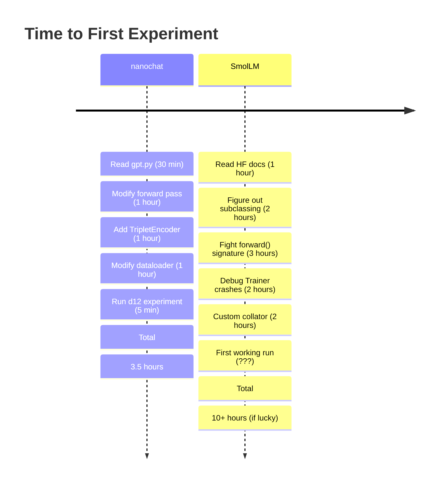


nanochat is **designed for this**. Karpathy built it specifically for fast iteration on architecture ideas. The code is minimal, hackable, and has zero hidden layers (pun intended).


### 4. The Speedrun as a Baseline


nanochat gives you a **complete pipeline** in `runs/speedrun.sh`:
1. Pretrain
2. Evaluate (CORE, BPB)
3. SFT
4. RL
5. Deploy web UI


You can compare your triplet-augmented model against the baseline at every stage. SmolLM has no such equivalent — you'd be building evaluation and deployment infrastructure from scratch.


---


## Concrete Recommendation


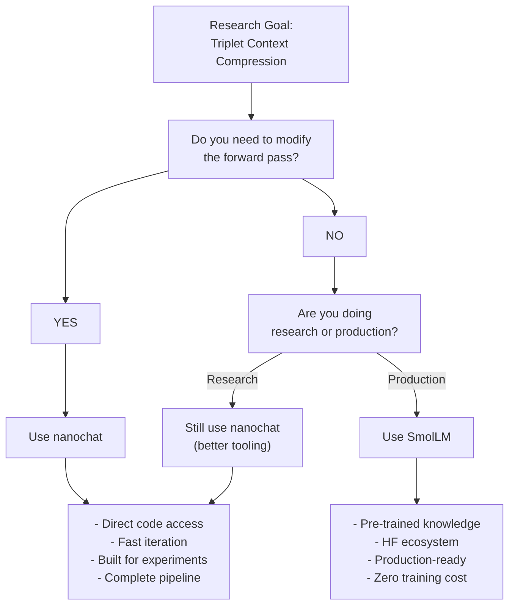


**For triplet context compression: nanochat, no question.**


You're doing architecture research. You need to:
- Modify the forward pass (add triplet embeddings)
- Change the data loader (yield triplets alongside tokens)
- Alter the attention mechanism (triplets as read-only memory)
- Iterate quickly (run d12 in 5 minutes, not 2 hours)


All of this is **trivial in nanochat, painful in SmolLM**.


---


## The Hybrid Path (If You Insist on SmolLM)


If you *really* want to leverage SmolLM's pre-trained knowledge, here's the least-painful path:


1. **Implement triplet compression in nanochat first.** Validate the idea with a d12 or d20 model. Run ablations. Prove it works.


2. **Distill the approach into SmolLM.** Once you know the architecture works, you can invest the time to retrofit it into SmolLM. At that point, you're not doing research — you're doing engineering. The research risk is gone.


3. **Or just train nanochat to 1.7B parameters.** nanochat scales to arbitrary depth. Want a 1.7B model? Set `--depth=40` or so and train longer. You'll spend $200-300 instead of $73, but you'll have a model trained *with* triplet compression from the start, not retrofitted.


---


## Summary: The Decision Matrix


| Criterion | nanochat | SmolLM |
|---|---|---|
| **Architecture access** | ✅ Full control | ❌ Library abstractions |
| **Data loading flexibility** | ✅ Custom formats trivial | ❌ Fight HF datasets |
| **Attention modifications** | ✅ Direct access to FA3 | ❌ Reimplement or monkey-patch |
| **Experiment velocity** | ✅ 5-min runs (d12) | ❌ Hours per experiment |
| **Training cost** | ✅ $73 for GPT-2 | ✅ $0 (pre-trained) |
| **Pre-trained knowledge** | ❌ Train from scratch | ✅ 600B-1T tokens already |
| **Hackability** | ✅ 7.4K lines, readable | ❌ 200K+ library code |
| **Deployment ecosystem** | ⚠️ Custom (but included) | ✅ HF ecosystem (ONNX, GGUF, etc.) |
| **Research velocity** | ✅ Designed for it | ❌ Designed for users |
| **Risk of wasted effort** | ✅ Low (fast iteration) | ❌ High (architecture fights) |


**Verdict:** nanochat by a landslide for this project.


---


## Appendix: What Each Codebase Is Designed For


**nanochat:**
> "I want to understand and modify how transformers work at a low level."


Built for researchers, students, and tinkerers. Prioritizes clarity and hackability over performance and features. You're expected to read and modify the code.


**SmolLM:**
> "I need a small, efficient language model for my app."


Built for practitioners deploying on-device models (mobile, edge). Prioritizes efficiency and pre-trained capability over modifiability. You're expected to use the HuggingFace API, not modify internals.


**Your project (triplet compression):**
> "I want to test a novel idea about how transformers represent context."


This is the *definition* of a nanochat use case. You're proposing an architecture change, not an application. nanochat is built for exactly this.


---


## Final Recommendation


**Start with nanochat. Don't even think about SmolLM until you've validated the triplet compression idea.**


1. Spend a week modifying nanochat (gpt.py, dataloader.py, add TripletEncoder)
2. Run a d12 with triplets, compare perplexity to baseline
3. If it works, scale to d20, d24, GPT-2 (d26)
4. Publish your findings, open-source the modified nanochat


If triplet compression becomes a proven technique and you want production deployment, *then* consider the effort of retrofitting SmolLM. But by then, you'll have a working reference implementation and clear evidence of value.


---


## Sources


- [SmolLM: Small Language Models by HuggingFace](https://huggingface.co/blog/smollm)
- [nanochat README](https://github.com/karpathy/nanochat)
- [nanochat speedrun leaderboard](https://github.com/karpathy/nanochat#leaderboard)


# Triplet Context Compression: Structured Memory for Transformers


> **Status:** Proposal / Early Research
> **Applies to:** nanochat GPT architecture (`nanochat/gpt.py`)
> **Core claim:** Replace raw token history with knowledge graph triplets as a structured, compressed context window — giving the model 3-40x more effective context at the same compute cost.


---


## 1. The Problem with Raw Token Context


Every transformer today burns its entire attention budget on raw tokens. A 2048-token context window in nanochat stores *everything* — function words, punctuation, repeated phrases, filler — with equal weight.


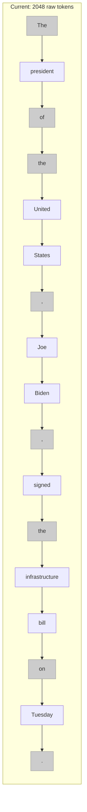


8 out of 17 tokens (the grey ones) carry near-zero semantic content. They're syntactic scaffolding. The model spends attention on "the", ",", and "." when what actually matters is: **Biden signed the infrastructure bill on Tuesday**.


Now multiply this waste across 2048 positions. At best, half the context window holds real information. The rest is structural noise.


---


## 2. The Idea: Triplets as Compressed Memory


What if older context was stored not as raw tokens, but as knowledge graph triplets?


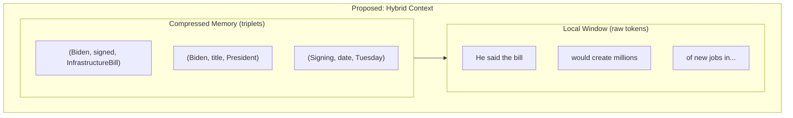


The model keeps a **short raw token window** (last 512-1024 tokens) for syntactic coherence and local context. Everything older gets **extracted into triplets** — a structured, compressed representation that preserves facts while discarding filler.


3 triplets replace 17 tokens. That's a **5.7x compression** on a single sentence. On longer passages, the ratio climbs to **20-40x**.


---


## 3. Architecture


### 3.1 The Two-Zone Attention Window


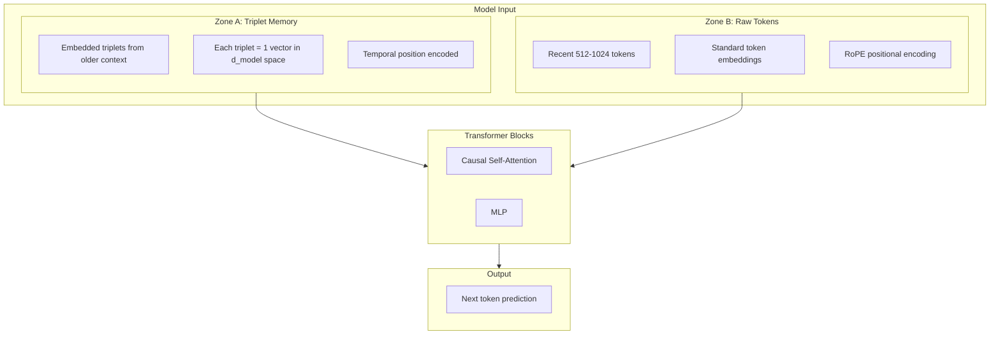


**Attention rules:**
- Raw tokens attend to **both** triplets and other raw tokens (causal)
- Triplets are **read-only** — they don't attend to raw tokens (they're finalized summaries)
- Triplets attend to each other (entity relationships across the memory)


### 3.2 How Triplets Enter the Model


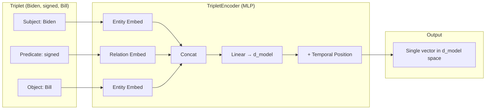


Each triplet becomes **one position** in the attention window. A vocabulary of entities and relations is learned alongside the token vocabulary. The temporal position tells the model *when* in the conversation this fact was established — critical for tracking state changes ("Biden signed" at time T, "Biden vetoed" at time T+500).


### 3.3 Integration with nanochat's GPT


The change to `gpt.py` forward pass is minimal:


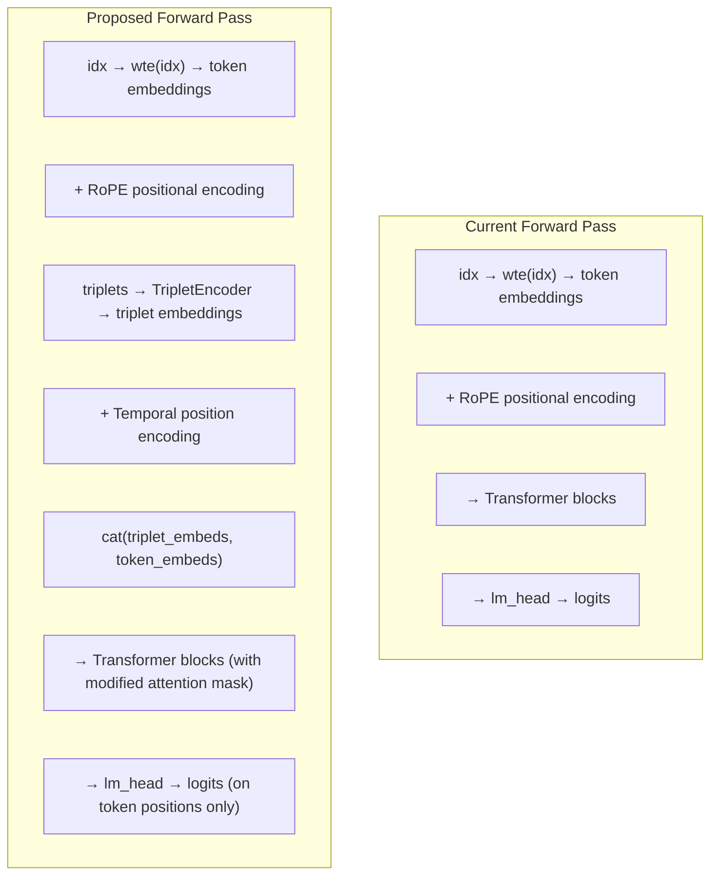


The loss function, optimizer, and training loop stay **unchanged**. The model still does next-token prediction. It just has a richer, more structured context to predict from.


---


## 4. The Compression Advantage


### 4.1 Concrete Examples


**Example 1: Legal Document**


A 2048-token legal passage about a contract dispute:


```
Raw tokens: 2048 positions consumed
Key facts: ~12 (parties, dates, clauses, amounts, rulings)
```


As triplets:
```
(AliceCorp, sued, BobLLC)
(Lawsuit, filed_on, 2024-03-15)
(Contract, value, $2.4M)
(AliceCorp, claims, BreachOfContract)
(Clause7, requires, DeliveryBy2024-01)
(BobLLC, delivered_on, 2024-03-01)
(BobLLC, defense, ForceMajeure)
(Judge, ruled, InFavorOfAlice)
(Damages, amount, $800K)
(BobLLC, must_pay_by, 2024-12-31)
(AliceCorp, represented_by, SmithLaw)
(BobLLC, represented_by, JonesLLP)
```


**12 triplets = 12 positions. Compression: 170x.**


The model now has the remaining ~2036 positions for fresh raw tokens. Effective context: the information content of **~4000 raw tokens** in the space of 2048.


**Example 2: Multi-turn Conversation**


```
User: I'm working on a Python web app using FastAPI. The database is PostgreSQL.
     I need help with the authentication system. We're using JWT tokens.
     The frontend is React. Deployment is on AWS ECS.


[... 6 more turns discussing implementation details ...]
```


After 8 turns (~1500 tokens consumed), the triplet memory contains:


```
(Project, language, Python)
(Project, framework, FastAPI)
(Project, database, PostgreSQL)
(Project, auth_method, JWT)
(Project, frontend, React)
(Project, deployment, AWS_ECS)
(Auth, status, InProgress)
(User, needs_help_with, TokenRefresh)
```


**8 triplets instead of ~1500 tokens. Compression: 187x.**


Every future turn can reference "the project uses FastAPI" without re-reading 1500 tokens of conversation history. The model knows the full project context in 8 attention positions.


**Example 3: Story/Narrative (worst case)**


```
"The old man sat by the window, watching the rain trace paths
down the glass like tears on a weathered face."
```


As triplets:
```
(OldMan, action, Sitting)
(OldMan, location, ByWindow)
(Rain, action, Falling)
```


**Compression: ~5x — but the soul of the sentence is lost.** The simile, the mood, the imagery — gone. This is where triplet compression is weakest. The model would need the raw tokens for any literary, stylistic, or emotional content.


This is why the **two-zone design is essential** — raw tokens for what's recent and nuanced, triplets for what's older and factual.


---


### 4.2 Effective Context Scaling


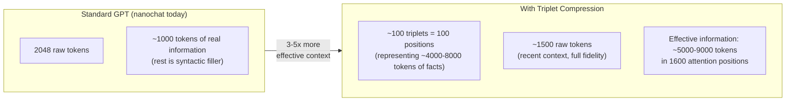


The attention cost stays roughly the same (similar number of positions), but the **information bandwidth** of the context window multiplies.


---


## 5. How It Compares


### 5.1 vs. Longer Context Windows


The brute-force alternative: just make the context longer (4096, 8192, 128K tokens).


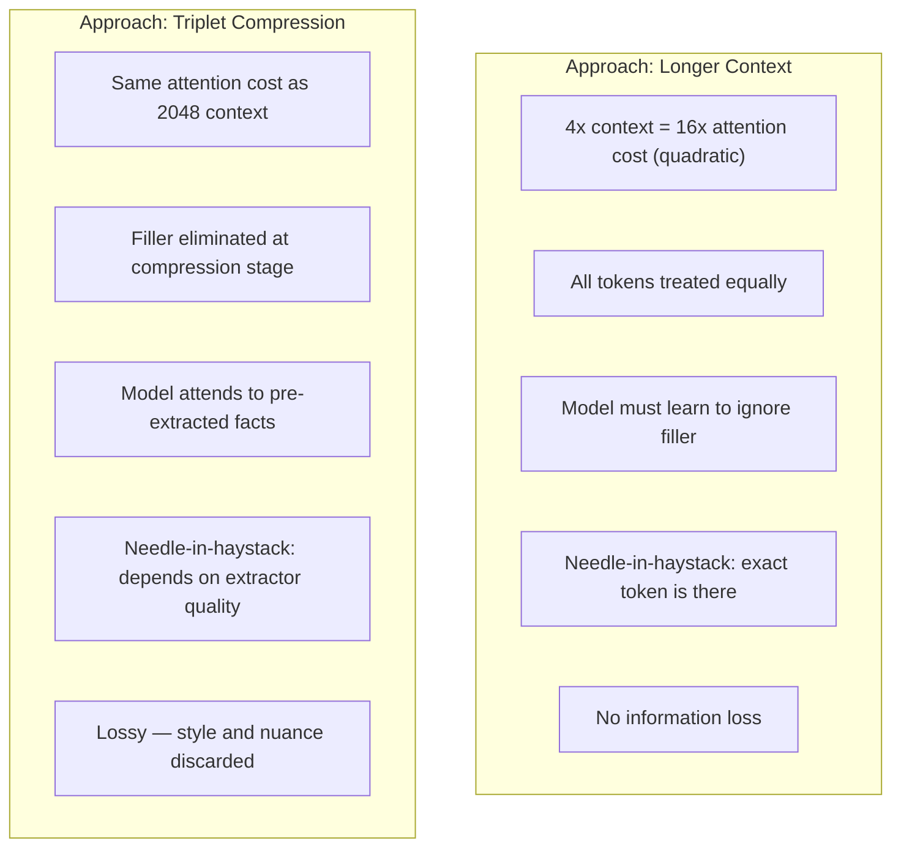


Longer context is better when you need verbatim recall ("what was the exact wording?"). Triplet compression is better when you need **factual reasoning over large spans** ("what did the user say about authentication three pages ago?").


The key insight: **most real tasks need facts, not verbatim recall.** Coding assistance, Q&A, analysis, conversation — these are all fact-retrieval problems where triplet compression should win.


### 5.2 vs. Existing Memory Compression Approaches


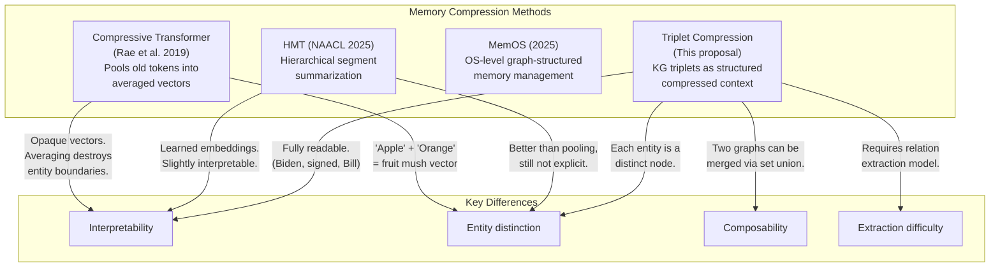


**The core advantage over pooling/averaging:** triplets maintain **entity boundaries**. If the context mentions both Alice and Bob with different attributes, a pooled vector blurs them together. Triplets keep `(Alice, role, Engineer)` and `(Bob, role, Designer)` as distinct, addressable facts.


**The core advantage over learned memory embeddings:** triplets are **interpretable and debuggable**. When the model gets something wrong, you can inspect the triplet memory and see exactly what information it had available. With opaque embeddings, you can't.


---


## 6. The Extraction Pipeline


This is the hardest engineering challenge. The quality of the entire system depends on the triplet extractor.


### 6.1 Three Extraction Strategies


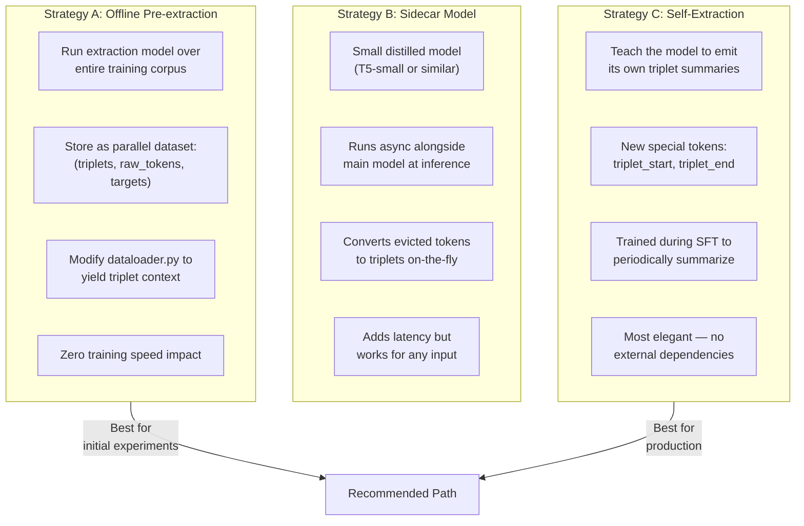


**Strategy A** is the right starting point. It's the least risky and lets you test whether the model actually benefits from triplet context before investing in live extraction.


**Strategy C** is the most exciting long-term. nanochat already has tool-use tokens (`<|python_start|>`, `<|output_start|>` in `tokenizer.py`). Adding `<|triplet_start|>` / `<|triplet_end|>` follows the same pattern. The model learns to emit structured summaries of its own context — a form of **learned, structured self-compression**.


### 6.2 Handling the Hard Cases


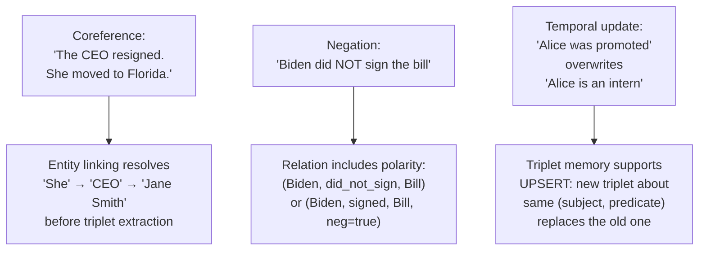


These are real challenges, but they're **solvable engineering problems**, not fundamental blockers. Coreference resolution, negation handling, and temporal updates are all active research areas with working solutions.


---


## 7. Implementation Plan for nanochat


### 7.1 Four Incremental Steps


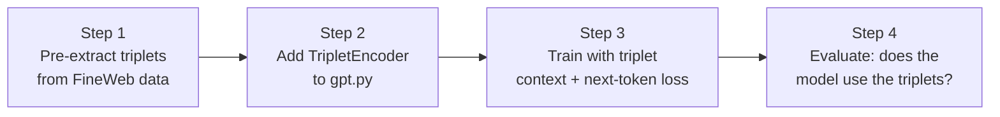


**Step 1 — Data preparation.** Run an off-the-shelf relation extraction model (e.g., REBEL, or a prompted LLM) over the FineWeb training data. For each document, produce a parallel file of extracted triplets. Store alongside the existing parquet shards.


**Step 2 — Model changes.** Add to `gpt.py`:
- An entity/relation vocabulary and embedding table
- A `TripletEncoder` MLP: `(e_subj, e_rel, e_obj) → d_model`
- A temporal position encoding for triplets
- Modified forward pass: prepend triplet embeddings before token embeddings
- An attention mask that lets tokens attend to triplets but not vice versa


**Step 3 — Training.** Modify `dataloader.py` to yield `(triplets, input_tokens, target_tokens)`. Modify `base_train.py` to pass triplets through the encoder and concatenate. Loss function stays **identical** — cross-entropy next-token prediction. The model learns to leverage triplet context through gradient signal alone.


**Step 4 — Validation.** Run ablations:
- Does masking out triplets increase perplexity? (If not, the model ignores them — stop here.)
- Does providing more triplets from further back improve performance?
- Compare CORE eval scores with and without triplet context.
- Compare against a baseline with equivalent raw-token context length.


### 7.2 What Changes, What Doesn't


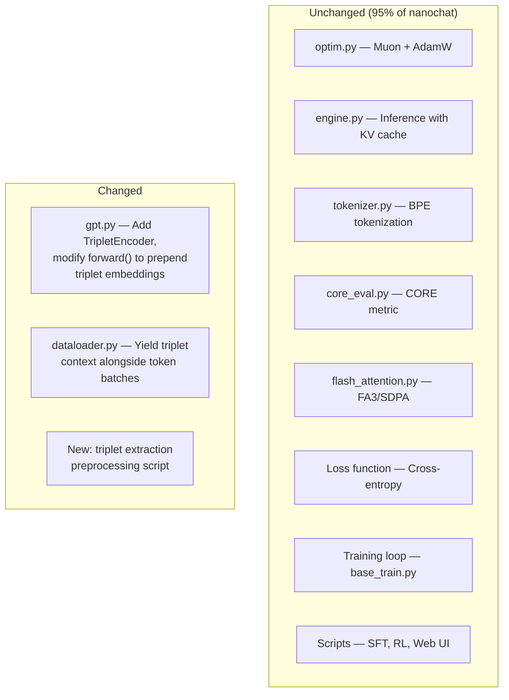


The change is **surgical**. The transformer architecture, optimizer, loss, evaluation — all untouched. You're adding a new input pathway, not redesigning the model.


---


## 8. Why This Could Matter


### 8.1 The Scaling Argument


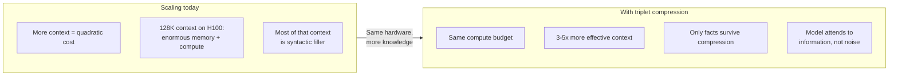


The current path to longer context is brute force: more positions, more memory, more FLOPs. Triplet compression offers an alternative scaling axis — **compress the information, not expand the compute**. A model with 2048 positions and triplet compression could carry the factual bandwidth of an 8K-context model at a fraction of the cost.


### 8.2 The Interpretability Win


Every other compression method (pooling, learned embeddings, KV cache eviction) produces opaque vectors. You cannot look at a compressed memory slot and say "this represents the fact that Alice is an engineer."


With triplets, you can. The model's memory is a readable, debuggable knowledge graph. When the model makes a mistake, you check the triplets: was the fact there? Was it extracted correctly? Was the temporal position right? This is **mechanistic interpretability for free**.


### 8.3 The Composability Win


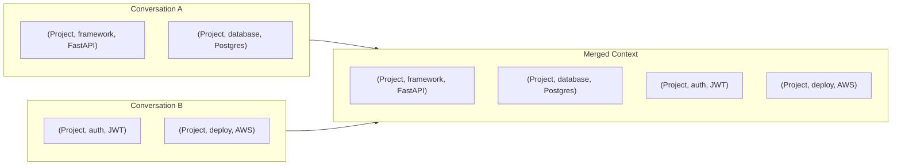


Merging context from two conversations is a **set union on triplets**. No re-encoding, no re-embedding, no re-training. You can build persistent user profiles, project contexts, or knowledge bases that carry across sessions — something raw token context fundamentally cannot do.


---


## 9. Risks and Honest Limitations


| Risk | Severity | Mitigation |
|---|---|---|
| Triplet extraction quality is poor | **High** | Start with offline pre-extraction using best available models. Measure extraction accuracy before training. |
| Model ignores triplet context entirely | **Medium** | Ablation in Step 4 catches this early. If triplets don't reduce perplexity, stop. |
| Coreference errors fragment the graph | **Medium** | Use coreference resolution as a preprocessing step. Accept some fragmentation — the model can still learn from imperfect triplets. |
| Loss of stylistic/emotional content | **Low (by design)** | Raw token window handles this. Triplets only compress *older* context where facts matter more than style. |
| Flash Attention incompatibility | **Low** | Triplets are prepended as regular positions. The attention mask is a simple block-causal structure, fully compatible with FA3. |
| Schema drift across long contexts | **Medium** | Normalize entity and relation names during extraction. Use canonical forms. |


The biggest risk is extraction quality. If the extractor produces garbage triplets, the model learns to ignore them, and you've gained nothing. **This is why offline pre-extraction and ablation testing (Steps 1 and 4) come first** — you validate the idea cheaply before committing to architecture changes.


---


## 10. Summary


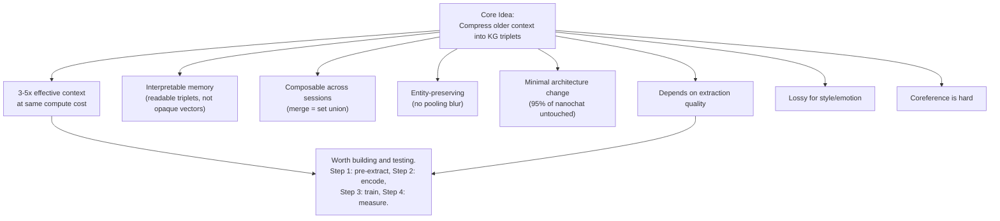


This is not a moonshot. It's a **tractable, incremental experiment** that can be validated or killed in a single training run. The potential upside — 3-5x effective context with interpretable, composable memory — justifies the engineering investment of modifying two files and preprocessing one dataset.


The model stays a language model. It still trains on text. It still predicts tokens. It just remembers better.


---


## References


- Rae et al., "Compressive Transformers for Long-Range Sequence Modelling" (2019) — [arxiv.org/abs/1911.05507](https://arxiv.org/abs/1911.05507)
- KnowFormer: Transformers for Knowledge Graph Reasoning (2024) — [arxiv.org/html/2409.12865v1](https://arxiv.org/html/2409.12865v1)
- iHT: Pre-training Transformers for KG Completion (2023) — [arxiv.org/abs/2303.15682](https://arxiv.org/abs/2303.15682)
- TGformer: Graph Transformer for KG Embedding (IEEE, 2026) — [ieeexplore.ieee.org/document/10742302](https://ieeexplore.ieee.org/document/10742302/)
- HMT: Hierarchical Memory Transformer (NAACL 2025) — [aclanthology.org/2025.naacl-long.410](https://aclanthology.org/2025.naacl-long.410.pdf)
- MemOS: A Memory Operating System for AI (2025) — [memtensor.com.cn/files/MemOS_0707](https://statics.memtensor.com.cn/files/MemOS_0707.pdf)
- APE: Context Compression with Attention (ICLR 2025)
- Language Modeling Is Compression (ICLR 2024)
- Graphormer: Do Transformers Really Perform Bad for Graph Representation? (2021) — [arxiv.org/abs/2106.05234](https://arxiv.org/abs/2106.05234)


# nanochat VRAM Requirements Guide


> **Quick answer:** For the full GPT-2 speedrun, you need **8x H100 (80GB each)** or equivalent. For quick experiments (d12), **24GB VRAM** is enough. For triplet compression research, **40GB VRAM** gives you good flexibility.


---


## Memory Breakdown by Model Size


| Model | Params | Model Weights | Optimizer State | Activations* | Total Memory |
|---|---|---|---|---|---|
| **d4** (tiny) | 79M | 0.16 GB | 0.63 GB | 0.05 GB | **~1 GB** |
| **d12** (GPT-1) | 135M | 0.27 GB | 1.08 GB | 2.42 GB | **~4 GB** |
| **d20** (small) | 192M | 0.38 GB | 1.54 GB | 8.05 GB | **~10 GB** |
| **d24** (GPT-2-ish) | 220M | 0.44 GB | 1.76 GB | 9.66 GB | **~12 GB** |
| **d26** (speedrun, FP8) | 234M | 0.23 GB | 1.87 GB | 2.62 GB | **~5 GB** |


*Activations at batch_size=32 for d12/d20/d24, batch_size=16 for d26 (with FP8)


---


## GPU Tiers and What You Can Do


```mermaid
graph TD
   subgraph "16GB VRAM (RTX 4080, RTX 3090)"
       T1["d4-d8 models<br/>batch_size=1-2"]
       T1_USE["Use case: Toy experiments,<br/>architecture validation"]
   end


   subgraph "24GB VRAM (RTX 4090, RTX 3090 Ti, A10)"
       T2["d12 (GPT-1 scale)<br/>batch_size=4-8"]
       T2_USE["Use case: Quick experiments<br/>(~5 min runs), ablations"]
   end


   subgraph "40GB VRAM (A100 40GB)"
       T3["d12-d16<br/>batch_size=16-32"]
       T3_USE["Use case: Serious research,<br/>triplet compression dev"]
   end


   subgraph "80GB VRAM (A100 80GB, H100)"
       T4["d20-d26<br/>batch_size=16-32"]
       T4_USE["Use case: Full GPT-2 training,<br/>leaderboard submissions"]
   end


   T1 --> T1_USE
   T2 --> T2_USE
   T3 --> T3_USE
   T4 --> T4_USE
```


---


## Recommended Configurations


### 1. Consumer GPU (RTX 4090, 24GB)


**Best model: d12 with batch_size=4**


```bash
# Quick 5-minute experiment
python -m scripts.base_train \
   --depth=12 \
   --device-batch-size=4 \
   --run="d12_experiment" \
   --core-metric-every=999999 \
   --save-every=-1
```


**Memory usage:** ~6-8 GB
**Training time:** ~5 minutes to convergence
**Cost:** You own the GPU, so $0
**Good for:**
- Testing triplet compression architecture changes
- Rapid iteration on ideas
- Learning the codebase


---


### 2. Single A100 40GB


**Best model: d16 with batch_size=16**


```bash
python -m scripts.base_train \
   --depth=16 \
   --device-batch-size=16 \
   --run="d16_experiment"
```


**Memory usage:** ~30-35 GB
**Training time:** ~20-30 minutes to convergence
**Cost:** ~$1-2/hour on cloud providers
**Good for:**
- Serious research experiments
- Validating ideas before scaling up
- Triplet compression proof-of-concept


---


### 3. Single A100 80GB or H100


**Best model: d20-d24 with batch_size=32**


```bash
python -m scripts.base_train \
   --depth=20 \
   --device-batch-size=32 \
   --run="d20_experiment"
```


**Memory usage:** ~50-60 GB
**Training time:** ~1-2 hours to convergence
**Cost:** ~$2-3/hour (A100) or ~$3-4/hour (H100)
**Good for:**
- Near-GPT-2 capability
- Pre-publication validation
- Single-GPU alternative to multi-GPU speedrun


---


### 4. 8x H100 80GB (The Speedrun Config)


**Model: d26 with batch_size=16, FP8**


```bash
# From runs/speedrun.sh
OMP_NUM_THREADS=1 torchrun --standalone --nproc_per_node=8 \
   -m scripts.base_train -- \
   --depth=26 \
   --device-batch-size=16 \
   --fp8 \
   --target-param-data-ratio=8.5 \
   --run=speedrun
```


**Memory usage per GPU:** ~30-40 GB (FP8 reduces memory)
**Total cluster memory:** 640 GB
**Training time:** ~2.9 hours (current leaderboard record)
**Cost:** ~$70-75
**Good for:**
- Leaderboard submissions
- Full GPT-2 capability
- Publication-quality results


---


## Memory Scaling Strategies


### Strategy 1: Reduce Batch Size (Easiest)


```mermaid
flowchart LR
   PROBLEM["Out of Memory"]


   SOLUTION1["Reduce --device-batch-size"]


   DETAILS["Examples:<br/>32 → 16 (half memory)<br/>16 → 8 (quarter memory)<br/>8 → 4<br/>4 → 2<br/>2 → 1"]


   RESULT["Gradient accumulation<br/>automatically compensates.<br/>Same effective batch size,<br/>slightly slower."]


   PROBLEM --> SOLUTION1 --> DETAILS --> RESULT
```


**Command:**
```bash
# Instead of default batch_size=32
python -m scripts.base_train --depth=12 --device-batch-size=8
```


**Trade-off:**
- ✅ Uses 4x less memory
- ❌ ~10-20% slower (more gradient accumulation steps)
- ✅ **Results are identical** (same effective batch size maintained)


---


### Strategy 2: Use FP8 (Requires H100)


FP8 training cuts memory usage roughly in half:


```bash
python -m scripts.base_train \
   --depth=26 \
   --fp8 \
   --device-batch-size=16
```


**Requirements:**
- ✅ Hopper architecture GPU (H100, not A100)
- ✅ `torchao` library (included in nanochat)


**Benefits:**
- ~2x less memory for activations
- ~5% faster training (recent leaderboard improvement)
- Same final model quality


---


### Strategy 3: Multi-GPU (Splits Batch Across GPUs)


```mermaid
graph TD
   subgraph "Single GPU: 32 batch_size = 60GB"
       SINGLE["Full batch on one GPU"]
   end


   subgraph "2x GPUs: 16 batch_size each = 30GB per GPU"
       MULTI1["GPU 0: batch 16"]
       MULTI2["GPU 1: batch 16"]
   end


   subgraph "8x GPUs: 4 batch_size each = 8GB per GPU"
       MULTI8_1["GPU 0: batch 4"]
       MULTI8_2["GPU 1: batch 4"]
       MULTI8_3["..."]
       MULTI8_4["GPU 7: batch 4"]
   end


   SINGLE --> MULTI1
   SINGLE --> MULTI2
   MULTI1 --> MULTI8_1
   MULTI2 --> MULTI8_2
   MULTI8_2 --> MULTI8_3
   MULTI8_3 --> MULTI8_4
```


**Command:**
```bash
# 2 GPUs (halves memory per GPU)
torchrun --nproc_per_node=2 -m scripts.base_train -- --depth=20 --device-batch-size=16


# 8 GPUs (1/8th memory per GPU, 8x faster)
torchrun --nproc_per_node=8 -m scripts.base_train -- --depth=26 --device-batch-size=4
```


**Benefits:**
- Splits memory load across GPUs
- Faster training (near-linear scaling)
- Can train larger models


---


## Triplet Compression Memory Impact


Adding triplet context will **increase memory slightly**, but not dramatically:


### Baseline (no triplets)
```
Attention: batch_size × seq_len × d_model
        = 32 × 2048 × 768
        = 50M elements × 2 bytes = 100 MB
```


### With 100 triplets prepended
```
Attention: batch_size × (100 triplets + 1500 tokens) × d_model
        = 32 × 1600 × 768
        = 39M elements × 2 bytes = 78 MB


Triplet encoding: batch_size × 100 × (3 embeddings)
               = 32 × 100 × 3 × 768 × 2 bytes
               = ~15 MB
```


**Net effect:** ~10-15% memory overhead for triplet context. Negligible compared to optimizer states and gradients.


**Recommendation:** If you can run d12 without triplets, you can run d12 with triplets. Just reduce batch size by 10-20% to be safe.


---


## Common OOM (Out of Memory) Errors


### Error: "CUDA out of memory"


**Fix 1 — Reduce batch size:**
```bash
# Change from --device-batch-size=32 to:
--device-batch-size=16  # Try first
--device-batch-size=8   # If still OOM
--device-batch-size=4   # If desperate
```


**Fix 2 — Reduce sequence length:**
```bash
# Change from default 2048 to:
--max-seq-len=1024  # Half the memory for activations
```


**Fix 3 — Reduce model depth:**
```bash
# Instead of --depth=20, try:
--depth=16  # or
--depth=12
```


---


### Error: "RuntimeError: Trying to backward through the graph a second time"


This is **not** a memory error. It's a gradient bug. Check your code for double `.backward()` calls.


---


### Error: "DefaultCPUAllocator: not enough memory"


You're running out of **RAM**, not VRAM. This happens during data loading.


**Fix:**
```bash
# Reduce the number of data loading workers (in dataloader.py)
# Or reduce the amount of data cached in memory
```


---


## Cost Comparison


| Configuration | VRAM | Training Time (d12) | Cost per Run | Use Case |
|---|---|---|---|---|
| RTX 4090 (owned) | 24GB | ~10 min | $0 | Learning, rapid iteration |
| 1x A100 40GB | 40GB | ~5 min | ~$0.10 | Quick experiments |
| 1x A100 80GB | 80GB | ~5 min | ~$0.15 | Larger experiments |
| 1x H100 | 80GB | ~3 min | ~$0.20 | Fast iteration |
| 8x H100 (speedrun) | 640GB | ~2.9 hours | ~$73 | GPT-2 capability |


For triplet compression research:
- **Prototyping:** Use a consumer GPU (RTX 4090) or single A100 40GB
- **Validation:** Run on 1-2x A100 80GB
- **Final results:** Scale to 8x H100 for GPT-2 comparison


---


## Recommendations for Your Triplet Project


```mermaid
flowchart TD
   START["Starting triplet<br/>compression research"]


   PHASE1["Phase 1: Prototype<br/>(1-2 weeks)"]
   PHASE2["Phase 2: Validate<br/>(1 week)"]
   PHASE3["Phase 3: Scale<br/>(3-4 hours)"]


   START --> PHASE1
   PHASE1 --> PHASE2
   PHASE2 --> PHASE3


   PHASE1 --> GPU1["24GB VRAM<br/>(RTX 4090, A10)"]
   GPU1 --> MODEL1["d12, batch_size=4-8<br/>~5 min per run<br/>Cost: $0-1"]
   MODEL1 --> TASK1["Implement TripletEncoder<br/>Test extraction pipeline<br/>Run ablations"]


   PHASE2 --> GPU2["40GB VRAM<br/>(A100 40GB)"]
   GPU2 --> MODEL2["d16-d20, batch_size=16<br/>~30 min per run<br/>Cost: $1-2/run"]
   MODEL2 --> TASK2["Compare to baseline<br/>Measure compression gains<br/>Publish proof-of-concept"]


   PHASE3 --> GPU3["8x 80GB VRAM<br/>(H100 cluster)"]
   GPU3 --> MODEL3["d26, batch_size=16, FP8<br/>~3 hours<br/>Cost: ~$75"]
   MODEL3 --> TASK3["Full GPT-2 comparison<br/>Leaderboard submission<br/>Paper results"]
```


**Budget estimate for full research project:**
- Prototyping (d12, 100 runs): $0-100
- Validation (d16-d20, 20 runs): $20-40
- Final scaling (d26, 3 runs): $225
- **Total: ~$250-350** for a complete research project from idea to publication


Compare this to fine-tuning SmolLM: similar cost, but you'd spend weeks fighting HuggingFace instead of days implementing your idea.


---


## Summary


| Your GPU | What You Can Do | Memory Strategy |
|---|---|---|
| **16GB** (RTX 3090, 4080) | d4-d8, toy experiments | batch_size=1-2 |
| **24GB** (RTX 4090, A10) | d12 quick experiments (5 min) | batch_size=4-8 ← **Start here** |
| **40GB** (A100 40GB) | d16-d20 serious research | batch_size=16 ← **Validate here** |
| **80GB** (A100 80GB, H100) | d20-d24 near-GPT-2 | batch_size=32 |
| **8x 80GB** (H100 cluster) | d26 full speedrun, GPT-2 | batch_size=16 + FP8 ← **Scale here** |


**For triplet compression:** Start with 24GB (d12), validate with 40GB (d16-d20), scale to 8x80GB (d26) for final results.


