# Triplet Compression Experiment: Complete Implementation Guide

> **Purpose:** A phase-by-phase implementation guide written so that an autonomous coding agent can execute each step without ambiguity. Every phase includes rationale, workflow graph, exact file paths, code patterns, success criteria, and failure recovery.
>
> **Hardware:** NVIDIA RTX 3090 (24GB VRAM), 32GB RAM, 8 CPU cores, CUDA 12.4
> **Target Model:** nanochat d12 (768 dim, 6 heads, 12 layers, ~135M params)
> **Codebase:** nanochat (https://github.com/karpathy/nanochat)

---

## How to Use This Document

Each phase follows this template:
1. **Rationale** — Why this phase exists and what question it answers
2. **Prerequisites** — What must be completed before starting
3. **Workflow Graph** — Mermaid diagram of the phase's steps
4. **Detailed Steps** — Exact instructions with file paths, code changes, and commands
5. **Success Criteria** — How to verify the phase completed correctly
6. **Failure Modes** — What can go wrong and how to recover
7. **Outputs** — What artifacts this phase produces for downstream phases

---

## Phase 0: Establish Baseline

### Rationale

**Why:** Every experiment needs a control. Before adding triplet compression, we must know the baseline performance of a standard d12 model on our specific hardware. This gives us:
- A reference BPB (bits per byte) to compare against
- A reference CORE score (22-task evaluation ensemble)
- Exact training throughput numbers (tokens/sec) so we can measure the overhead of triplet augmentation
- A checkpoint we can reload for fair comparison (same initialization, same data)

Without this baseline, any improvement (or regression) from triplets is unmeasurable.

**What question does this answer?** "What is the performance of a standard d12 model trained on our data with our hardware?"

### Prerequisites

- nanochat repository cloned
- Python environment set up with `uv`
- CUDA 12.4 working with PyTorch
- Internet access for data download

### Workflow

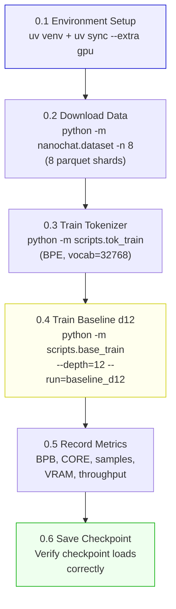

### Detailed Steps

#### 0.1 Environment Setup

```bash
cd /home/para2x/Documents/Github/nanochat
uv venv && source .venv/bin/activate
uv sync --extra gpu
```

**What this does:** Creates a Python virtual environment and installs all dependencies including PyTorch with CUDA support.

**Verify:** `python -c "import torch; print(torch.cuda.is_available(), torch.cuda.get_device_name(0))"` should print `True NVIDIA GeForce RTX 3090`.

#### 0.2 Download Training Data

```bash
python -m nanochat.dataset -n 8
```

**What this does:** Downloads 8 parquet shards from the FineWeb-EDU-100B-shuffle dataset to `~/.cache/nanochat/base_data/`. Each shard is ~250MB. Total ~2GB.

**Verify:** `ls ~/.cache/nanochat/base_data/shard_0000*.parquet | wc -l` should show 8 files.

#### 0.3 Train Tokenizer

```bash
python -m scripts.tok_train
```

**What this does:** Trains a BPE tokenizer with GPT-4 split pattern on the downloaded data. Vocabulary size 32768. Saves to `~/.cache/nanochat/tok32768.model`.

**Verify:** File `~/.cache/nanochat/tok32768.model` exists and is >100KB.

#### 0.4 Train Baseline d12

```bash
python -m scripts.base_train \
    --depth=12 \
    --device-batch-size=4 \
    --run="baseline_d12" \
    --eval-every=250 \
    --core-metric-every=1000 \
    --sample-every=1000
```

**What this does:** Trains a 12-layer, 768-dim GPT model. With `device-batch-size=4` on RTX 3090, each step processes 4 × 2048 = 8192 tokens. Gradient accumulation brings effective batch to ~524K tokens. Training runs for the default number of iterations based on the scaling law formula `D = 10.5 × scaling_params`.

**Hyperparameters (automatically computed):**
- Model dim: 768, heads: 6, layers: 12
- Effective batch: 524,288 tokens
- Window pattern: SSSL (3 short + 1 long window per 4 layers)
- Optimizer: Muon (matrices) + AdamW (embeddings/scalars)
- Warmdown ratio: 0.5 (LR linearly decays to 0 over last 50% of training)

**Expected duration:** 2–4 hours on RTX 3090.
**Expected peak VRAM:** 6–8 GB.

**Verify during training:** Watch for decreasing loss in the terminal output. If loss does not decrease after 100 steps, something is wrong.

#### 0.5 Record Baseline Metrics

After training completes, record these values (they will be printed to terminal and logged to wandb if `--run` is not "dummy"):

| Metric | Where to Find | Record Value |
|---|---|---|
| Final validation BPB | Terminal output at last eval step | _____ |
| CORE score | Terminal output at last core-metric step | _____ |
| Per-task CORE breakdown | wandb dashboard or terminal | _____ |
| Training tokens processed | Terminal output (total_tokens) | _____ |
| Training time (seconds) | Terminal output (total_training_time) | _____ |
| Peak VRAM (GB) | Run `nvidia-smi` during training | _____ |
| Tokens/sec | Terminal output (tok_per_sec) | _____ |

**Save these to a file:** `results/baseline_d12_metrics.json`

#### 0.6 Save and Verify Checkpoint

The checkpoint is automatically saved by the training script. Verify it loads:

```bash
python -c "
import torch
from nanochat.gpt import GPT, GPTConfig
config = GPTConfig(n_layer=12, n_head=6, n_embd=768)
model = GPT(config)
# Find the latest checkpoint
import glob
ckpts = sorted(glob.glob('~/.cache/nanochat/baseline_d12/model_*.pt'))
if ckpts:
    state = torch.load(ckpts[-1], map_location='cpu')
    model.load_state_dict(state, strict=True)
    print(f'Checkpoint loaded successfully: {ckpts[-1]}')
else:
    print('WARNING: No checkpoint found')
"
```

### Success Criteria

- [ ] Training completes without errors or NaN losses
- [ ] Validation BPB is recorded and below 2.0 (sanity check — untrained is ~10+)
- [ ] CORE score is recorded and above 0.0 (sanity check)
- [ ] Checkpoint file exists and loads without errors
- [ ] All metrics saved to `results/baseline_d12_metrics.json`

### Failure Modes

| Failure | Symptom | Recovery |
|---|---|---|
| CUDA OOM | `RuntimeError: CUDA out of memory` | Reduce `--device-batch-size` to 2 or 1 |
| NaN loss | `loss: nan` in output | Check data download integrity; re-download shards |
| Tokenizer not found | `FileNotFoundError: tok32768.model` | Re-run `python -m scripts.tok_train` |
| Slow training | <1000 tok/sec | Check no other GPU processes running; verify CUDA version |

### Outputs

- `~/.cache/nanochat/baseline_d12/model_XXXXXX.pt` — Model checkpoint
- `~/.cache/nanochat/baseline_d12/meta_XXXXXX.json` — Training metadata
- `results/baseline_d12_metrics.json` — Recorded metrics (create this manually or via script)

---

## Phase 1: Triplet Data Preparation

### Rationale

**Why:** The triplet-augmented model needs a parallel dataset of knowledge graph triplets extracted from the training data. The quality of these triplets determines the ceiling of the entire approach — if the extraction produces garbage, the model will learn to ignore them, and the experiment produces a null result.

This phase front-loads the hardest engineering risk: **extraction quality**. We validate triplet quality BEFORE investing in model architecture changes. If triplets are garbage, we stop here and try a better extractor — saving days of wasted effort.

**What question does this answer?** "Can we extract high-quality (subject, relation, object) triplets from FineWeb training data, and what do they look like?"

### Prerequisites

- Phase 0 completed (we need the downloaded data shards)
- `transformers` library installed (for REBEL model)
- Sufficient disk space (~2GB for triplet parquet files)

### Workflow

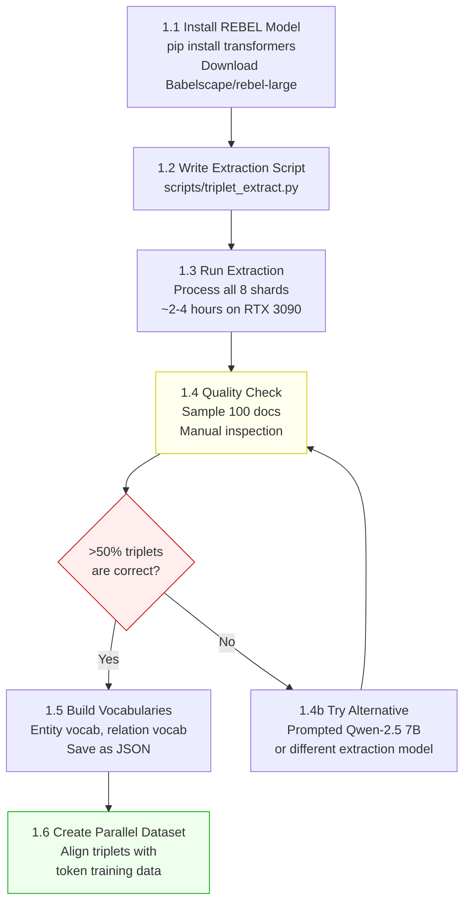

### Detailed Steps

#### 1.1 Install REBEL Model

```bash
pip install transformers sentencepiece protobuf
```

The REBEL model (`Babelscape/rebel-large`) is a ~770M parameter T5-based seq2seq model fine-tuned for open information extraction. It takes text as input and outputs structured triplets in a special format.

**VRAM requirement:** ~3GB for inference. Fits alongside the nanochat model on RTX 3090.

#### 1.2 Write Extraction Script

Create file: `scripts/triplet_extract.py`

This script must do the following:

1. **Load REBEL model** from HuggingFace (`Babelscape/rebel-large`)
2. **Iterate over each parquet shard** in `~/.cache/nanochat/base_data/`
3. **For each document:**
   a. Split text into chunks of ~512 tokens (REBEL's effective context window)
   b. Run REBEL on each chunk to extract triplets
   c. Parse REBEL's output format: `<triplet> subject <subj> object <obj> relation <rel>`
   d. Deduplicate triplets within the document (same subject + relation → keep latest)
4. **Save output** as parallel parquet files: `~/.cache/nanochat/triplet_data/triplets_shard_XXXXX.parquet`

**Output schema per row:**
```
document_id: int          — matches row index in source shard
triplets: list[dict]      — each dict has keys: subject, relation, object
  subject: str
  relation: str
  object: str
chunk_offsets: list[int]  — token offset where each chunk starts
```

**Critical implementation detail — REBEL output parsing:**

REBEL outputs text in this format:
```
<s><triplet> United States <subj> Joe Biden <obj> president of <triplet> Joe Biden <subj> infrastructure bill <obj> signed
```

The parsing logic:
```python
def parse_rebel_output(text):
    triplets = []
    # Split on <triplet> tokens
    for segment in text.split('<triplet>')[1:]:
        parts = segment.strip().split('<subj>')
        if len(parts) != 2:
            continue
        subject = parts[0].strip()
        rest = parts[1].strip().split('<obj>')
        if len(rest) != 2:
            continue
        object_entity = rest[0].strip()
        relation = rest[1].strip()
        if subject and relation and object_entity:
            triplets.append({
                'subject': subject,
                'relation': relation,
                'object': object_entity
            })
    return triplets
```

**Performance target:** ~50-100 documents per minute on RTX 3090 with batch size 8.

**Total extraction time for 8 shards:** ~2-4 hours (each shard has ~50K documents, we process ~50-100/min).

#### 1.3 Run Extraction

```bash
python -m scripts.triplet_extract \
    --input-dir ~/.cache/nanochat/base_data/ \
    --output-dir ~/.cache/nanochat/triplet_data/ \
    --num-shards 8 \
    --batch-size 8 \
    --device cuda
```

**Monitor progress:** The script should print progress (shard X/8, documents processed, triplets extracted per document).

#### 1.4 Quality Check

**This is the most important step in the entire experiment.** Sample 100 documents and their extracted triplets. For each, manually assess:

1. **Precision:** What fraction of extracted triplets are factually correct?
   - Count: correct triplets / total triplets = precision
   - Target: >70% precision

2. **Recall (approximate):** Read the document and identify key facts. How many appear as triplets?
   - Target: >40% recall (we accept lossy compression)

3. **Common failure modes to check for:**
   - Coreference failure: "She" as subject instead of resolved entity name
   - Negation missing: "(Biden, signed, Bill)" when text says "Biden did NOT sign"
   - Garbage triplets: meaningless relations, truncated entities
   - Over-extraction: trivial triplets like "(text, is, long)")

Create a quality report: `results/triplet_quality_report.md`

```markdown
## Triplet Extraction Quality Report

- **Documents sampled:** 100
- **Total triplets extracted:** ___
- **Average triplets per document:** ___
- **Precision (correct/total):** ____%
- **Estimated recall:** ____%
- **Common failure modes:** [list]

### Go/No-Go Decision
[ ] Precision > 70% → PROCEED to Phase 1.5
[ ] Precision 50-70% → Add post-processing filters, re-check
[ ] Precision < 50% → STOP. Try alternative extractor.
```

**Go/No-Go Gate:** If precision < 50%, do NOT proceed. Try:
1. Post-processing filters (remove triplets with <3 char entities, remove known-bad patterns)
2. A different extractor (prompted Qwen-2.5 7B, or GPT-4 API for a small validation set)
3. A simpler extraction strategy (only extract named entity pairs with explicit verb relations)

#### 1.5 Build Entity and Relation Vocabularies

After extraction passes the quality gate:

```python
# Collect all unique entities and relations
all_subjects = set()
all_objects = set()
all_relations = set()

for shard in triplet_shards:
    for doc in shard:
        for triplet in doc['triplets']:
            all_subjects.add(triplet['subject'].lower().strip())
            all_objects.add(triplet['object'].lower().strip())
            all_relations.add(triplet['relation'].lower().strip())

all_entities = sorted(all_subjects | all_objects)
all_relations = sorted(all_relations)

# Cap vocabularies
MAX_ENTITIES = 50_000
MAX_RELATIONS = 5_000

# Keep most frequent, map rest to <UNK>
entity_vocab = ['<PAD>', '<UNK>'] + most_frequent(all_entities, MAX_ENTITIES - 2)
relation_vocab = ['<PAD>', '<UNK>'] + most_frequent(all_relations, MAX_RELATIONS - 2)

# Save
json.dump({'entities': entity_vocab}, open('entity_vocab.json', 'w'))
json.dump({'relations': relation_vocab}, open('relation_vocab.json', 'w'))
```

Save vocabularies to: `~/.cache/nanochat/triplet_data/entity_vocab.json` and `relation_vocab.json`.

**Record statistics:**
- Total unique entities before capping: ___
- Total unique relations before capping: ___
- Entity <UNK> rate: ___% (entities mapped to <UNK> because they're out-of-vocab)
- Relation <UNK> rate: ___%

#### 1.6 Create Aligned Parallel Dataset

The key data alignment requirement:

For each training sample (a 2048-token window from a document), we need the triplets from the **preceding** text in the same document. This simulates "older context compressed into triplets."

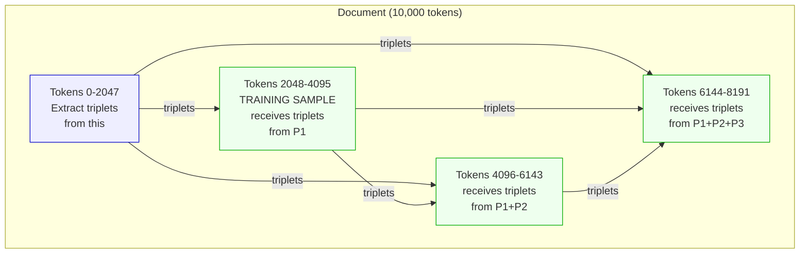

Create a new script or extend `triplet_extract.py` to produce the aligned dataset:

**Output format per training sample:**
```
token_shard_idx: int        — which shard the tokens come from
document_id: int            — document within shard
sample_start_token: int     — where in the document this sample starts
triplet_ids: list[list[int]] — each inner list is [subject_id, relation_id, object_id]
                               IDs reference the vocab files
temporal_positions: list[int] — relative position (0=most recent triplet)
```

Save to: `~/.cache/nanochat/triplet_data/aligned_shard_XXXXX.parquet`

### Success Criteria

- [ ] Extraction script runs without errors on all 8 shards
- [ ] Quality check passes (precision > 70%)
- [ ] Entity vocabulary saved (~50K entries)
- [ ] Relation vocabulary saved (~5K entries)
- [ ] Aligned parallel dataset created with triplet IDs matching vocab indices
- [ ] At least 80% of training samples have >0 associated triplets

### Failure Modes

| Failure | Symptom | Recovery |
|---|---|---|
| REBEL OOM | CUDA OOM during extraction | Reduce batch size to 1; or run on CPU (slower) |
| Low precision (<50%) | Quality check fails | Try prompted LLM extraction or stricter filtering |
| High <UNK> rate (>30%) | Too many out-of-vocab entities | Increase entity vocab cap to 100K or use hash embeddings |
| Few triplets per doc (<3) | Most docs produce 0-2 triplets | Check REBEL is getting full text; increase chunk overlap |
| Alignment mismatch | Triplets don't correspond to correct preceding context | Debug alignment script; add document boundary detection |

### Outputs

- `~/.cache/nanochat/triplet_data/triplets_shard_XXXXX.parquet` — Raw extracted triplets (8 files)
- `~/.cache/nanochat/triplet_data/entity_vocab.json` — Entity vocabulary
- `~/.cache/nanochat/triplet_data/relation_vocab.json` — Relation vocabulary
- `~/.cache/nanochat/triplet_data/aligned_shard_XXXXX.parquet` — Aligned training data (8 files)
- `results/triplet_quality_report.md` — Quality assessment

---

## Phase 2: Model Architecture Changes

### Rationale

**Why:** The triplet-augmented model needs three new components added to nanochat's GPT architecture:
1. A **TripletEncoder** module that converts `(subject_id, relation_id, object_id)` into a d_model vector
2. A **modified forward pass** that prepends triplet embeddings before token embeddings
3. A **block-causal attention mask** that enforces the read-only property of triplets

These changes must be surgical — touching only the necessary code paths — to minimize the risk of introducing bugs into the well-tested base model. The base model's behavior must be **exactly preserved** when no triplets are provided (backward compatibility).

**What question does this answer?** "Can we modify the nanochat GPT architecture to accept triplet inputs without breaking the base model?"

### Prerequisites

- Phase 0 completed (baseline model works)
- Phase 1 completed (we have entity/relation vocab sizes for embedding dimensions)
- Entity vocab size: ~50K
- Relation vocab size: ~5K

### Workflow

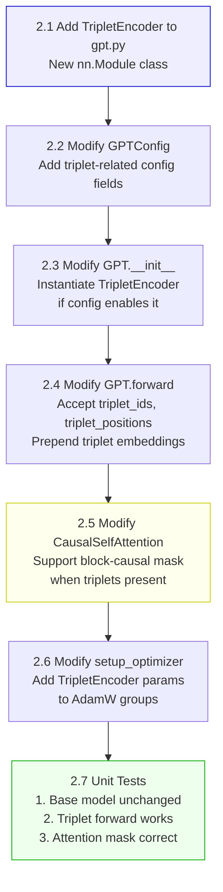

### Detailed Steps

#### 2.1 Add TripletEncoder Module

**File:** `nanochat/gpt.py`
**Location:** After the `CausalSelfAttention` class definition, before the `MLP` class.

```python
class TripletEncoder(nn.Module):
    """Encode (subject, relation, object) triplets into d_model vectors.

    Each triplet component gets its own embedding table. The three embeddings
    are concatenated and projected to d_model, then a temporal position
    embedding is added to encode when in the document this fact was established.
    """

    def __init__(self, n_entities: int, n_relations: int, n_embd: int, max_triplets: int = 128):
        super().__init__()
        # Split d_model across three components
        entity_dim = n_embd // 3
        relation_dim = n_embd - 2 * entity_dim  # remainder goes to relation

        self.entity_embed = nn.Embedding(n_entities, entity_dim)
        self.relation_embed = nn.Embedding(n_relations, relation_dim)
        self.proj = nn.Linear(n_embd, n_embd, bias=False)
        self.temporal_embed = nn.Embedding(max_triplets, n_embd)

    def forward(self, triplet_ids: torch.Tensor, temporal_positions: torch.Tensor) -> torch.Tensor:
        """
        Args:
            triplet_ids: (B, M, 3) int tensor — [subject_id, relation_id, object_id]
            temporal_positions: (B, M) int tensor — relative temporal position (0 = most recent)

        Returns:
            (B, M, d_model) float tensor — triplet embeddings in the same space as token embeddings
        """
        subj = self.entity_embed(triplet_ids[:, :, 0])   # (B, M, entity_dim)
        rel = self.relation_embed(triplet_ids[:, :, 1])   # (B, M, relation_dim)
        obj = self.entity_embed(triplet_ids[:, :, 2])     # (B, M, entity_dim)

        x = torch.cat([subj, rel, obj], dim=-1)  # (B, M, d_model)
        x = self.proj(x)                         # (B, M, d_model)
        x = x + self.temporal_embed(temporal_positions)
        return norm(x)  # Use nanochat's parameterless RMSNorm
```

**Parameter count:**
- `entity_embed`: 50,000 × 256 = 12.8M parameters
- `relation_embed`: 5,000 × 256 = 1.28M parameters
- `proj`: 768 × 768 = 589K parameters
- `temporal_embed`: 128 × 768 = 98K parameters
- **Total: ~14.8M parameters (10.9% of base d12 model)**

#### 2.2 Modify GPTConfig

**File:** `nanochat/gpt.py`
**Location:** The `GPTConfig` dataclass.

Add these fields:

```python
@dataclass
class GPTConfig:
    sequence_len: int = 2048
    vocab_size: int = 32768
    n_layer: int = 12
    n_head: int = 6
    n_kv_head: int = 6
    n_embd: int = 768
    window_pattern: str = "SSSL"
    # Triplet compression config
    use_triplets: bool = False
    n_entities: int = 50000
    n_relations: int = 5000
    max_triplets: int = 128
```

**Critical constraint:** When `use_triplets=False`, the model must behave exactly as the original. All triplet code paths must be guarded by `if self.config.use_triplets`.

#### 2.3 Modify GPT.__init__

**File:** `nanochat/gpt.py`
**Location:** In the `GPT.__init__` method, after existing module creation.

Add:

```python
# Triplet encoder (only created if use_triplets=True)
self.triplet_encoder = None
if config.use_triplets:
    self.triplet_encoder = TripletEncoder(
        n_entities=config.n_entities,
        n_relations=config.n_relations,
        n_embd=config.n_embd,
        max_triplets=config.max_triplets,
    )
```

Also, extend the RoPE cos/sin buffers to handle the additional triplet positions:

```python
# In the section that creates cos/sin for RoPE:
max_seq = config.sequence_len + config.max_triplets if config.use_triplets else config.sequence_len
# Use max_seq instead of config.sequence_len when creating cos/sin
```

#### 2.4 Modify GPT.forward

**File:** `nanochat/gpt.py`
**Location:** The `GPT.forward` method.

The modified forward pass must:

1. Accept optional `triplet_ids` and `triplet_positions` arguments
2. Encode triplets if provided
3. Prepend triplet embeddings to token embeddings
4. Offset RoPE positions for tokens (triplets get positions 0..M-1, tokens get M..M+T-1)
5. Compute logits only on token positions (not triplet positions)
6. Compute loss only on token positions

```python
def forward(self, idx, targets=None, triplet_ids=None, triplet_positions=None,
            kv_cache=None, loss_reduction='mean'):
    B, T = idx.size()

    # Standard token embeddings
    x = self.transformer.wte(idx)
    x = norm(x)

    # Prepend triplet embeddings if provided
    N_triplets = 0
    if triplet_ids is not None and self.triplet_encoder is not None:
        triplet_embeds = self.triplet_encoder(triplet_ids, triplet_positions)
        N_triplets = triplet_embeds.size(1)
        x = torch.cat([triplet_embeds, x], dim=1)  # (B, M+T, d_model)

    x0 = x  # Save for x0 residual connections

    T_total = N_triplets + T
    cos = self.cos[:, :T_total]
    sin = self.sin[:, :T_total]

    for i, block in enumerate(self.transformer.h):
        x = self.resid_lambdas[i] * x + self.x0_lambdas[i] * x0

        # Value embeddings: only for token positions, pad triplet positions with zeros
        ve = None
        if str(i) in self.value_embeds:
            if N_triplets > 0:
                ve_tokens = self.value_embeds[str(i)](idx)
                ve_pad = torch.zeros(B, N_triplets, ve_tokens.size(-1),
                                     device=idx.device, dtype=ve_tokens.dtype)
                ve = torch.cat([ve_pad, ve_tokens], dim=1)
            else:
                ve = self.value_embeds[str(i)](idx)

        x = block(x, ve, (cos, sin), self.window_sizes[i], kv_cache,
                  n_triplets=N_triplets)  # Pass N_triplets for attention mask

    x = norm(x)

    # Logits only on token positions
    x_tokens = x[:, N_triplets:, :]
    logits = self.lm_head(x_tokens)
    logits = logits[..., :self.config.vocab_size]
    logits = logits.float()
    logits = 15 * torch.tanh(logits / 15)  # softcap

    if targets is not None:
        loss = F.cross_entropy(
            logits.view(-1, logits.size(-1)),
            targets.view(-1),
            ignore_index=-1,
            reduction=loss_reduction
        )
        return loss
    return logits
```

#### 2.5 Modify CausalSelfAttention for Block-Causal Mask

**File:** `nanochat/gpt.py`
**Location:** `CausalSelfAttention.forward` method.

The attention mechanism must support two modes:
1. **No triplets (n_triplets=0):** Behave exactly as before — causal attention with optional sliding window via Flash Attention
2. **With triplets (n_triplets>0):** Use an explicit block-causal mask

```python
def forward(self, x, ve, cos_sin, window_size, kv_cache, n_triplets=0):
    B, T_total, C = x.size()

    q = self.c_q(x).view(B, T_total, self.n_head, self.head_dim)
    k = self.c_k(x).view(B, T_total, self.n_kv_head, self.head_dim)
    v = self.c_v(x).view(B, T_total, self.n_kv_head, self.head_dim)

    # Value embedding mixing (unchanged)
    if ve is not None:
        ve = ve.view(B, T_total, self.n_kv_head, self.head_dim)
        gate = 2 * torch.sigmoid(self.ve_gate(x[..., :self.ve_gate_channels]))
        v = v + gate.unsqueeze(-1) * ve

    cos, sin = cos_sin
    q = apply_rotary_emb(q, cos, sin)
    k = apply_rotary_emb(k, cos, sin)
    q, k = norm(q), norm(k)

    if kv_cache is None:
        if n_triplets == 0:
            # Original path: Flash Attention with sliding window
            y = flash_attn.flash_attn_func(q, k, v, causal=True, window_size=window_size)
        else:
            # Triplet path: explicit block-causal mask via SDPA
            T_tokens = T_total - n_triplets

            # Build block-causal mask
            mask = torch.zeros(T_total, T_total, dtype=torch.bool, device=x.device)
            # Triplets attend to all triplets (bidirectional)
            mask[:n_triplets, :n_triplets] = True
            # Tokens attend to all triplets (full)
            mask[n_triplets:, :n_triplets] = True
            # Tokens attend to previous tokens (causal)
            mask[n_triplets:, n_triplets:] = torch.tril(
                torch.ones(T_tokens, T_tokens, dtype=torch.bool, device=x.device)
            )

            # Reshape for SDPA: (B, H, T, D)
            q_sdpa = q.transpose(1, 2)  # (B, H, T_total, D)
            k_sdpa = k.transpose(1, 2)
            v_sdpa = v.transpose(1, 2)

            # Handle GQA: expand KV heads if needed
            if self.n_kv_head < self.n_head:
                repeat = self.n_head // self.n_kv_head
                k_sdpa = k_sdpa.repeat_interleave(repeat, dim=1)
                v_sdpa = v_sdpa.repeat_interleave(repeat, dim=1)

            y = F.scaled_dot_product_attention(
                q_sdpa, k_sdpa, v_sdpa,
                attn_mask=mask.unsqueeze(0).unsqueeze(0),  # (1, 1, T, T) broadcasts over B, H
                is_causal=False  # We provide explicit mask
            )
            y = y.transpose(1, 2)  # Back to (B, T, H, D)
    else:
        # Inference path (unchanged)
        y = flash_attn.flash_attn_with_kvcache(...)

    y = y.reshape(B, T_total, C)
    y = self.c_proj(y)
    return y
```

**Important:** The block-causal mask path uses SDPA (not Flash Attention 3) because:
1. RTX 3090 (Ampere/sm86) doesn't support FA3 anyway
2. Custom masks are incompatible with FA3's `causal=True` shortcut
3. SDPA with explicit mask is correct and reasonably fast

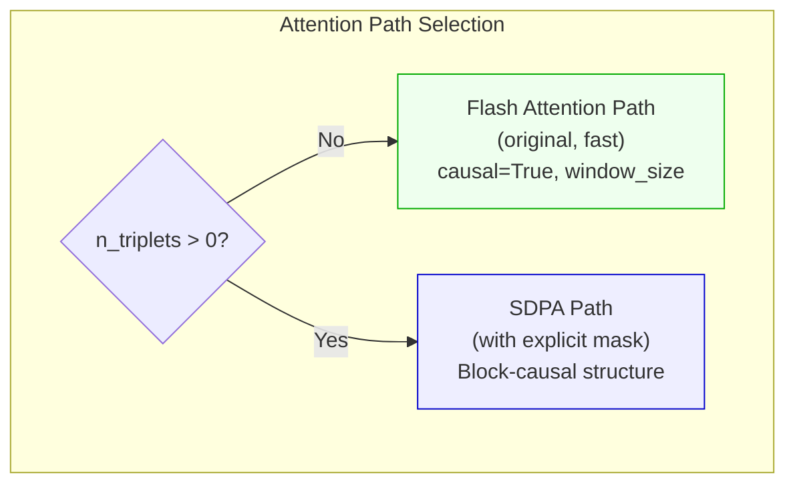

#### 2.6 Modify setup_optimizer

**File:** `nanochat/gpt.py`
**Location:** `GPT.setup_optimizer` method.

The TripletEncoder parameters need to be added to the AdamW optimizer groups. They should NOT be in the Muon groups (Muon is for matrix parameters in the transformer blocks only).

Add the TripletEncoder parameters to an AdamW group with learning rate similar to the token embedding:

```python
# In setup_optimizer, after existing AdamW groups:
if self.triplet_encoder is not None:
    adamw_groups.append({
        'params': list(self.triplet_encoder.parameters()),
        'lr': args.embedding_lr * (self.config.n_embd / 768) ** (-0.5),
        'betas': (0.8, 0.95),
        'eps': 1e-10,
        'weight_decay': 0.0,
    })
```

#### 2.7 Unit Tests

Create file: `tests/test_triplet_encoder.py`

Three critical tests:

**Test 1: Base model backward compatibility**
```python
def test_base_model_unchanged():
    """Model without triplets produces identical output to original."""
    config = GPTConfig(n_layer=2, n_head=2, n_embd=128, use_triplets=False)
    model = GPT(config)
    # ... verify forward pass matches original
```

**Test 2: Triplet forward pass**
```python
def test_triplet_forward():
    """Model with triplets produces valid output."""
    config = GPTConfig(n_layer=2, n_head=2, n_embd=128,
                       use_triplets=True, n_entities=100, n_relations=20)
    model = GPT(config)
    idx = torch.randint(0, 100, (2, 64))
    targets = torch.randint(0, 100, (2, 64))
    triplet_ids = torch.randint(0, 50, (2, 8, 3))
    triplet_positions = torch.arange(8).unsqueeze(0).expand(2, -1)
    loss = model(idx, targets, triplet_ids=triplet_ids, triplet_positions=triplet_positions)
    assert not torch.isnan(loss)
    assert loss.requires_grad
```

**Test 3: Attention mask correctness**
```python
def test_attention_mask():
    """Block-causal mask has correct structure."""
    from nanochat.gpt import build_triplet_mask  # or test inline
    mask = build_triplet_mask(n_triplets=4, t_tokens=8, device='cpu')
    # Triplets attend to all triplets
    assert mask[:4, :4].all()
    # Triplets don't attend to tokens
    assert not mask[:4, 4:].any()
    # Tokens attend to all triplets
    assert mask[4:, :4].all()
    # Tokens are causal among themselves
    assert mask[4:, 4:].equal(torch.tril(torch.ones(8, 8, dtype=torch.bool)))
```

### Success Criteria

- [ ] `TripletEncoder` module added to `gpt.py`
- [ ] `GPTConfig` has triplet fields with `use_triplets=False` default
- [ ] `GPT.forward` accepts and processes triplet arguments
- [ ] When `use_triplets=False` or no triplets provided, model behaves identically to original
- [ ] Block-causal attention mask correctly implemented
- [ ] All three unit tests pass
- [ ] No existing tests broken (`pytest tests/`)

### Failure Modes

| Failure | Symptom | Recovery |
|---|---|---|
| Shape mismatch | RuntimeError in forward pass | Check concatenation dimensions; ensure cos/sin extended to M+T |
| NaN in triplet embeddings | loss is NaN | Initialize TripletEncoder weights like token embeddings (normal, std=0.02) |
| Existing tests break | pytest failures | Verify all triplet code is behind `if self.config.use_triplets` or `if n_triplets > 0` guards |
| SDPA mask broadcasting error | Wrong mask shape | Mask must be (1, 1, T_total, T_total) for broadcasting over B, H |
| GQA incompatibility | Attention output wrong shape | Expand KV heads before SDPA when n_kv_head < n_head |

### Outputs

- Modified `nanochat/gpt.py` with TripletEncoder, modified forward, modified attention
- New `tests/test_triplet_encoder.py` with 3 unit tests
- All tests passing

---

## Phase 3: Dataloader Modifications

### Rationale

**Why:** The model architecture now accepts triplets, but the dataloader still yields only `(inputs, targets, state_dict)`. We need to modify the data pipeline to also yield the aligned triplet data created in Phase 1.

The key challenge is **alignment**: for each batch of token sequences, we must load the correct pre-extracted triplets from the parallel triplet dataset. The triplets must represent context from BEFORE the current token window (simulating compressed older context).

**What question does this answer?** "Can we modify the dataloader to efficiently serve triplet context alongside token batches?"

### Prerequisites

- Phase 1 completed (aligned triplet parquet files exist)
- Phase 2 completed (model accepts triplet arguments)

### Workflow

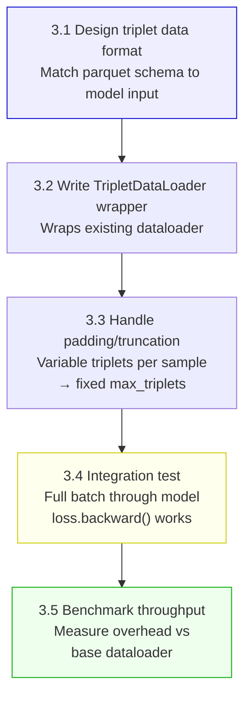

### Detailed Steps

#### 3.1 Design Triplet Data Format

The dataloader must yield:

```python
# Current: (inputs, targets, state_dict)
# New:     (inputs, targets, triplet_ids, triplet_positions, state_dict)
```

Where:
- `inputs`: (B, T) int tensor — token IDs (unchanged)
- `targets`: (B, T) int tensor — shifted targets (unchanged)
- `triplet_ids`: (B, max_triplets, 3) int tensor — [subject_id, relation_id, object_id]
- `triplet_positions`: (B, max_triplets) int tensor — relative temporal positions
- `state_dict`: dict — dataloader state for resumption (unchanged)

Padding: samples with fewer than `max_triplets` triplets are padded with zeros. The model should learn to ignore padding (all-zero triplets map to the <PAD> embedding which should be near-zero after training).

#### 3.2 Write TripletDataLoader Wrapper

**File:** `nanochat/dataloader.py`
**Location:** New function after the existing `tokenizing_distributed_data_loader_with_state_bos_bestfit`.

```python
def triplet_augmented_data_loader(base_loader, triplet_data_dir, max_triplets=64,
                                   entity_vocab_size=50000, relation_vocab_size=5000):
    """
    Wraps the base nanochat dataloader to add triplet context.

    For each batch yielded by base_loader, looks up pre-extracted triplets
    from the aligned parquet files and yields them alongside the tokens.

    Args:
        base_loader: Generator yielding (inputs, targets, state_dict)
        triplet_data_dir: Path to aligned triplet parquet files
        max_triplets: Maximum triplets per sample (pad/truncate to this)
        entity_vocab_size: For bounds checking
        relation_vocab_size: For bounds checking

    Yields:
        (inputs, targets, triplet_ids, triplet_positions, state_dict)
    """
    # Load triplet index (maps shard_idx + doc_idx + chunk_idx → triplet_ids)
    triplet_index = load_triplet_index(triplet_data_dir)

    for (inputs, targets, state_dict) in base_loader:
        B = inputs.size(0)

        triplet_ids = torch.zeros(B, max_triplets, 3, dtype=torch.long)
        triplet_positions = torch.zeros(B, max_triplets, dtype=torch.long)

        for b in range(B):
            # Look up triplets for this sample
            sample_triplets = triplet_index.get_triplets_for_sample(
                state_dict, b
            )

            # Truncate to max_triplets (keep most recent)
            if len(sample_triplets) > max_triplets:
                sample_triplets = sample_triplets[-max_triplets:]

            # Fill tensor
            for i, (s, r, o, pos) in enumerate(sample_triplets):
                triplet_ids[b, i, 0] = min(s, entity_vocab_size - 1)
                triplet_ids[b, i, 1] = min(r, relation_vocab_size - 1)
                triplet_ids[b, i, 2] = min(o, entity_vocab_size - 1)
                triplet_positions[b, i] = pos

        triplet_ids = triplet_ids.to(inputs.device)
        triplet_positions = triplet_positions.to(inputs.device)

        yield inputs, targets, triplet_ids, triplet_positions, state_dict
```

**Implementation note on `get_triplets_for_sample`:** The nanochat dataloader uses best-fit packing, which means each batch row may contain tokens from different documents. For the v1 implementation, a simplification:

- Track which document each row predominantly comes from (the document contributing the most tokens)
- Use that document's pre-extracted triplets
- Accept that some misalignment occurs at document boundaries

This is imperfect but sufficient for validating the approach. A more precise alignment can be implemented later.

#### 3.3 Handle Padding and Truncation

The padding scheme:

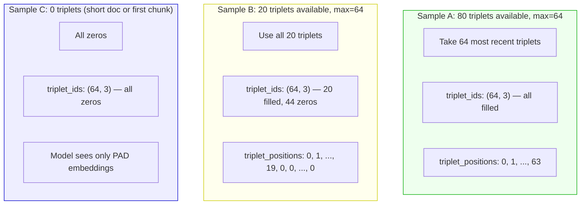

The model handles padding naturally: `<PAD>` (index 0) entity/relation embeddings will converge to near-zero during training, producing near-zero triplet embeddings that the attention mechanism learns to ignore.

#### 3.4 Integration Test

```python
def test_full_pipeline():
    """End-to-end test: dataloader → model → loss → backward."""
    config = GPTConfig(n_layer=2, n_head=2, n_embd=128,
                       use_triplets=True, n_entities=100, n_relations=20, max_triplets=8)
    model = GPT(config)

    # Simulate one batch
    B, T, M = 2, 64, 8
    inputs = torch.randint(0, 100, (B, T))
    targets = torch.randint(0, 100, (B, T))
    triplet_ids = torch.randint(0, 50, (B, M, 3))
    triplet_positions = torch.arange(M).unsqueeze(0).expand(B, -1)

    loss = model(inputs, targets, triplet_ids=triplet_ids, triplet_positions=triplet_positions)
    loss.backward()

    # Check gradients flow to TripletEncoder
    assert model.triplet_encoder.proj.weight.grad is not None
    assert model.triplet_encoder.entity_embed.weight.grad is not None
    print(f"Loss: {loss.item():.4f}")
    print(f"TripletEncoder grad norm: {model.triplet_encoder.proj.weight.grad.norm():.6f}")
```

#### 3.5 Benchmark Throughput

Compare dataloader throughput with and without triplet loading:

```bash
python -c "
import time
# Benchmark base loader
start = time.time()
for i, batch in enumerate(base_loader):
    if i >= 100: break
base_time = time.time() - start

# Benchmark triplet loader
start = time.time()
for i, batch in enumerate(triplet_loader):
    if i >= 100: break
triplet_time = time.time() - start

print(f'Base loader: {100/base_time:.1f} batches/sec')
print(f'Triplet loader: {100/triplet_time:.1f} batches/sec')
print(f'Overhead: {(triplet_time/base_time - 1)*100:.1f}%')
"
```

**Target:** <20% throughput overhead from triplet loading.

### Success Criteria

- [ ] Triplet dataloader wraps base loader correctly
- [ ] Output tensors have correct shapes: triplet_ids (B, M, 3), triplet_positions (B, M)
- [ ] Integration test passes: forward + backward through full pipeline
- [ ] Gradients flow to TripletEncoder parameters
- [ ] Throughput overhead <20%
- [ ] Padding handled correctly for variable triplet counts

### Failure Modes

| Failure | Symptom | Recovery |
|---|---|---|
| Parquet read bottleneck | Throughput drops >50% | Pre-load triplet data into memory; or use memory-mapped arrays |
| Alignment off-by-one | Triplets from wrong document | Add assertion: document IDs match between token and triplet shards |
| Device mismatch | Tensors on different devices | Ensure `.to(inputs.device)` on all triplet tensors |
| Memory overflow | RAM >32GB from loading all triplet parquets | Load shards lazily (only the current shard in memory) |

### Outputs

- Modified `nanochat/dataloader.py` with `triplet_augmented_data_loader` function
- Integration test script
- Throughput benchmark results

---

## Phase 4: Training

### Rationale

**Why:** With the architecture changes and data pipeline in place, we can now train the triplet-augmented d12 model. This is the central experiment — does the model learn to use triplet context?

Training must be done carefully with two levels of validation:
1. **Sanity check** (10 min): Quick run to verify no crashes, NaN, or obvious bugs
2. **Full training** (2-4 hours): Match baseline token budget for a fair comparison

We also run diagnostic ablations during or immediately after training to understand what the model learned.

**What question does this answer?** "Does a triplet-augmented d12 model achieve lower BPB than the baseline?"

### Prerequisites

- Phase 0: Baseline metrics recorded
- Phase 1: Triplet data prepared and quality-checked
- Phase 2: Model architecture changes implemented and tested
- Phase 3: Dataloader modifications working

### Workflow

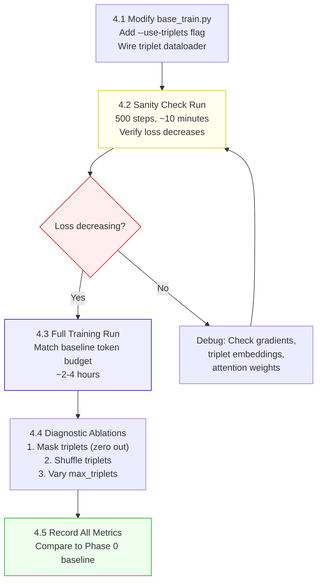

### Detailed Steps

#### 4.1 Modify base_train.py

**File:** `scripts/base_train.py`

Add command-line arguments:

```python
parser.add_argument("--use-triplets", action="store_true",
                    help="Enable triplet context compression")
parser.add_argument("--max-triplets", type=int, default=64,
                    help="Maximum triplets per training sample")
parser.add_argument("--triplet-data-dir", type=str,
                    default="~/.cache/nanochat/triplet_data/",
                    help="Directory containing aligned triplet parquet files")
```

Modify the training loop to pass triplets through the model:

```python
# In the gradient accumulation loop (around line 495):
if args.use_triplets:
    inputs, targets, triplet_ids, triplet_positions, dataloader_state_dict = next(train_loader)
    with autocast_ctx:
        train_loss = model(inputs, targets,
                          triplet_ids=triplet_ids,
                          triplet_positions=triplet_positions)
else:
    inputs, targets, dataloader_state_dict = next(train_loader)
    with autocast_ctx:
        train_loss = model(inputs, targets)
```

Modify model creation to pass config:

```python
if args.use_triplets:
    config = GPTConfig(
        ...,  # existing config
        use_triplets=True,
        max_triplets=args.max_triplets,
    )
```

Modify dataloader creation to wrap with triplet loader:

```python
if args.use_triplets:
    train_loader = triplet_augmented_data_loader(
        base_loader=train_loader,
        triplet_data_dir=args.triplet_data_dir,
        max_triplets=args.max_triplets,
    )
```

#### 4.2 Sanity Check Run

```bash
python -m scripts.base_train \
    --depth=12 \
    --device-batch-size=4 \
    --use-triplets \
    --max-triplets=64 \
    --run="triplet_sanity_check" \
    --eval-every=100 \
    --core-metric-every=9999999 \
    --sample-every=9999999
```

**Run for 500 steps (~10 minutes).** Check:
- [ ] No CUDA OOM errors
- [ ] Loss is not NaN
- [ ] Loss is decreasing (should drop from ~10 to <5 within 500 steps)
- [ ] GPU utilization >80% (not bottlenecked on data loading)

If loss is NOT decreasing:

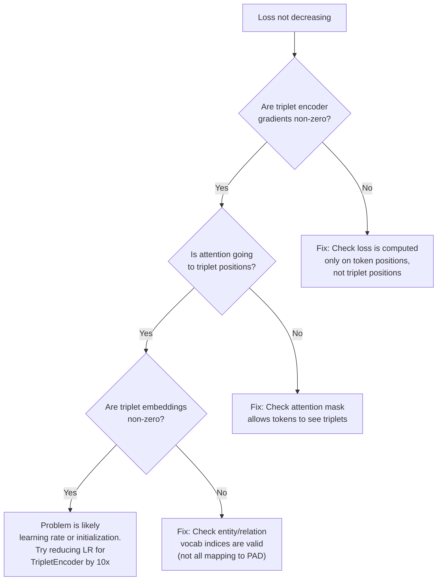

#### 4.3 Full Training Run

```bash
python -m scripts.base_train \
    --depth=12 \
    --device-batch-size=4 \
    --use-triplets \
    --max-triplets=64 \
    --run="triplet_d12_v1" \
    --eval-every=250 \
    --core-metric-every=1000 \
    --sample-every=1000
```

**Expected:**
- Duration: 2-4 hours
- Peak VRAM: 7-9 GB
- Tokens/sec: ~90% of baseline (slight overhead from custom attention mask)

#### 4.4 Diagnostic Ablations

After the full training run, evaluate the trained model under modified conditions:

**Ablation 1: Mask triplets (zero out)**
```python
# Load trained triplet model
# Evaluate with triplet_ids = torch.zeros_like(triplet_ids)
# Compare BPB: this tells us how much the model relies on triplets
```

**Ablation 2: Shuffle triplets across documents**
```python
# Load trained triplet model
# Evaluate with triplets from WRONG documents (random permutation of batch dim)
# If BPB ≈ correct triplets → model uses triplets as generic enrichment, not content
# If BPB > correct triplets → model reads triplet content (GOOD)
```

**Ablation 3: Vary max_triplets at eval time**
```python
# Evaluate with max_triplets = 0, 16, 32, 64, 128
# Plot BPB vs max_triplets
# Expected: BPB decreases with more triplets, diminishing returns
```

#### 4.5 Record All Metrics

Create: `results/triplet_d12_v1_metrics.json`

```json
{
    "model": "triplet_d12_v1",
    "max_triplets": 64,
    "val_bpb": "___",
    "core_score": "___",
    "per_task_core": {},
    "training_tokens": "___",
    "training_time_sec": "___",
    "peak_vram_gb": "___",
    "tokens_per_sec": "___",
    "ablations": {
        "bpb_with_triplets": "___",
        "bpb_without_triplets": "___",
        "bpb_shuffled_triplets": "___",
        "triplet_utilization_pct": "___"
    }
}
```

**Triplet utilization** = `(bpb_without - bpb_with) / bpb_without * 100`

### Success Criteria

- [ ] Full training completes without errors
- [ ] BPB recorded and comparable to or better than baseline
- [ ] CORE score recorded
- [ ] Triplet utilization > 1% (model uses triplets non-trivially)
- [ ] Shuffled triplets perform worse than correct triplets (model reads content)
- [ ] All metrics saved to results JSON

### Failure Modes

| Failure | Symptom | Recovery |
|---|---|---|
| BPB worse than baseline | triplet model > baseline BPB | Check if it's the extra parameters hurting. Train baseline with same extra params (random embeddings prepended) to control |
| Triplet utilization ≈ 0% | Masking triplets doesn't change BPB | Add auxiliary loss to force triplet reading (e.g., predict masked triplet component from context) |
| Shuffled ≈ correct | Model ignores triplet content | Triplet embeddings may be too similar. Check entity embedding variance; increase embedding dim |
| Training diverges | Loss spikes or NaN after many steps | Reduce LR for TripletEncoder; add gradient clipping for new parameters |

### Outputs

- `~/.cache/nanochat/triplet_d12_v1/model_XXXXXX.pt` — Trained model checkpoint
- `results/triplet_d12_v1_metrics.json` — All metrics and ablation results
- wandb logs (if --run is not "dummy")

---

## Phase 5: Comprehensive Evaluation

### Rationale

**Why:** Phase 4 gives us BPB and basic ablations. But to truly understand the triplet compression approach, we need to evaluate across six distinct dimensions:

1. **Triplet utilization** — Does the model use triplets at all?
2. **Attention patterns** — Where in the architecture do triplets get attended to?
3. **Effective context length** — Do triplets extend the model's factual reach?
4. **Hallucination** — Do triplets reduce factual errors?
5. **Token efficiency** — How much context does triplet compression save?
6. **Composability** — Can we merge triplet sets from different sources?

Each dimension answers a different scientific question about the approach.

**What question does this answer?** "Along which dimensions does triplet compression help, and by how much?"

### Prerequisites

- Phase 4 completed (trained triplet model + ablation results)
- Baseline model from Phase 0
- REBEL model available for triplet extraction from evaluation data

### Workflow

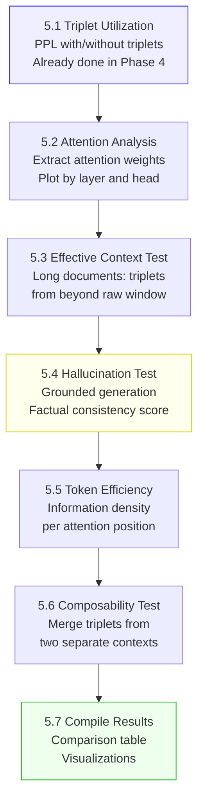

### Detailed Steps

#### 5.1 Triplet Utilization (from Phase 4)

Already computed. Key metric: **utilization %** = `(BPB_without - BPB_with) / BPB_without × 100`

Interpretation:
- **>10%**: Strong utilization — triplets are critical to the model
- **5-10%**: Moderate utilization — triplets help but aren't essential
- **1-5%**: Weak utilization — marginal benefit
- **<1%**: No utilization — model ignores triplets (experiment failed at this dimension)

#### 5.2 Attention Weight Analysis

**File:** Create `scripts/triplet_eval.py`

Register forward hooks on all attention layers to capture attention weights:

```python
def analyze_triplet_attention(model, eval_data, n_triplets):
    """Extract and analyze attention patterns with respect to triplet positions."""
    attention_maps = {}

    def hook_fn(layer_idx):
        def hook(module, input, output):
            # Capture attention weights before softmax
            # Store per-layer, per-head attention to triplets
            pass
        return hook

    # Register hooks
    for i, block in enumerate(model.transformer.h):
        block.attn.register_forward_hook(hook_fn(i))

    # Run evaluation
    for batch in eval_data:
        model(batch.inputs, triplet_ids=batch.triplet_ids, ...)

    # Analyze:
    # 1. Mean attention weight from tokens to triplets, per layer
    # 2. Which heads attend most to triplets?
    # 3. Does attention to triplets increase in deeper layers?
    # 4. Do triplets with relevant content get more attention?
```

**Expected results:** Deeper layers should attend more to triplets (early layers handle syntax, later layers handle semantics). A few "retrieval heads" should specialize in reading triplets.

#### 5.3 Effective Context Length Test

Design a controlled experiment:

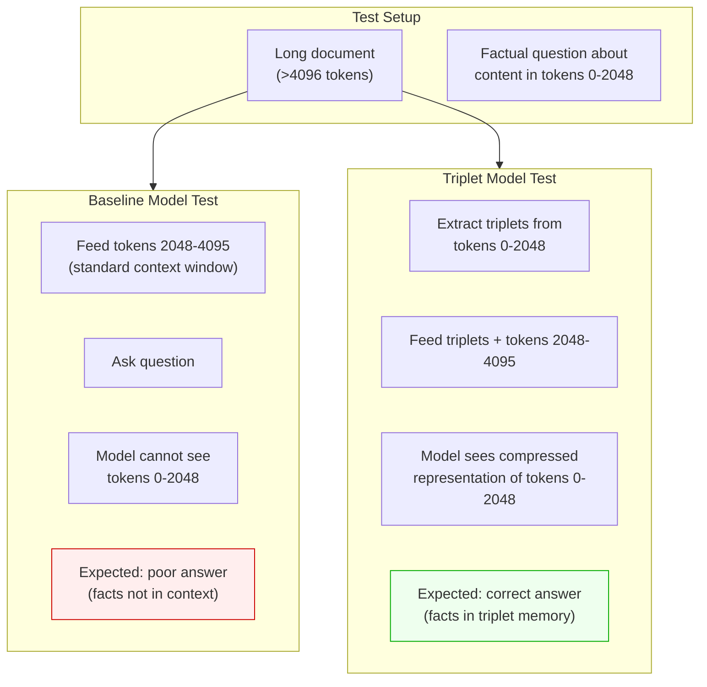

**Implementation:**
1. Select 100 documents >4096 tokens from the validation set
2. For each, create factual questions about content in the first 2048 tokens
3. Evaluate both models on the second 2048 tokens (with/without triplets from first 2048)
4. Score: does the model's continuation/answer reflect knowledge from the first half?

**Metric:** Accuracy on factual recall from beyond the raw context window.

#### 5.4 Hallucination Evaluation

**Grounded generation test:**

```python
def hallucination_test(model, test_cases):
    """
    Give the model triplets + a prompt. Check if the output
    is grounded in the triplets (not hallucinated).
    """
    results = []
    for triplets, prompt, ground_truth in test_cases:
        # Generate with triplets
        output_with = model.generate(prompt, triplets=triplets)

        # Generate without triplets
        output_without = model.generate(prompt)

        # Extract triplets from generated text
        generated_facts_with = extract_triplets(output_with)
        generated_facts_without = extract_triplets(output_without)

        # Score:
        # - Contradiction rate: facts that conflict with input triplets
        # - Fabrication rate: entities not present in input triplets
        # - Grounding rate: facts that are supported by input triplets
```

**Factual consistency score:**
- Extract triplets from model output using REBEL
- Compare to input triplets
- `consistency = supported_facts / total_generated_facts`
- Compare consistency between baseline and triplet model

#### 5.5 Token Efficiency Evaluation

**Perplexity per attention position:**

```
Baseline: PPL_base / T = PPL_base / 2048
Triplet:  PPL_triplet / (M + T) = PPL_triplet / (64 + 2048)

Efficiency ratio = (PPL_base / T) / (PPL_triplet / (M + T))
```

If ratio > 1: triplet model is more efficient per attention position.

**Information density test:**

For a set of long documents with known facts, find the minimum context needed to correctly answer factual questions:

```python
def min_context_for_accuracy(model, doc, questions, target_accuracy=0.8, triplets=None):
    """Binary search for minimum context length to achieve target accuracy."""
    lo, hi = 128, 2048
    while lo < hi:
        mid = (lo + hi) // 2
        acc = evaluate_accuracy(model, doc[-mid:], questions, triplets=triplets)
        if acc >= target_accuracy:
            hi = mid
        else:
            lo = mid + 1
    return lo
```

#### 5.6 Composability Test

```python
def composability_test(model):
    """Test merging triplets from two separate contexts."""
    # Document A: "Alice is an engineer at Google."
    triplets_a = [(Alice, role, Engineer), (Alice, employer, Google)]

    # Document B: "Google's HQ is in Mountain View."
    triplets_b = [(Google, hq_location, MountainView)]

    # Neither document alone answers: "Where does Alice work?"
    # But the merged triplet set does:
    merged = triplets_a + triplets_b

    # Generate answer with merged triplets
    answer = model.generate("Where is Alice's office located?", triplets=merged)
    # Expected: "Mountain View" (requires reasoning across both triplet sets)
```

This tests the unique composability property of triplet memory.

#### 5.7 Compile Results

Create: `results/comprehensive_evaluation.md`

```markdown
# Triplet Compression Evaluation Results

## Summary Table
| Dimension | Baseline d12 | Triplet d12 | Delta |
|---|---|---|---|
| Validation BPB | ___ | ___ | ___% |
| CORE Score | ___ | ___ | ___% |
| Triplet Utilization | N/A | ___% | — |
| Effective Context (accuracy) | ___% | ___% | +___pp |
| Hallucination Rate | ___% | ___% | -___pp |
| Token Efficiency | ___ | ___ | ___× |
| Composability Test | N/A | ___/10 correct | — |

## Per-Task CORE Breakdown
[table of 22 tasks]

## Attention Analysis
[heatmaps by layer]

## Detailed Results
[per-dimension analysis]
```

### Success Criteria

- [ ] All 6 evaluation dimensions completed
- [ ] Comprehensive results document created
- [ ] At least 2 dimensions show meaningful improvement over baseline
- [ ] Results are reproducible (random seeds fixed)

### Outputs

- `scripts/triplet_eval.py` — Evaluation suite
- `results/comprehensive_evaluation.md` — Full results document
- Attention heatmaps / visualization files

---

## Phase 6: Ablation Studies

### Rationale

**Why:** Phases 4-5 tell us WHETHER triplet compression works. Phase 6 tells us WHY and WHAT MATTERS. Ablations systematically vary one dimension at a time to isolate the contribution of each design choice.

This is critical for scientific rigor: without ablations, we cannot distinguish "triplets help because of structured facts" from "triplets help because of extra parameters" or "triplets help because of attention mask changes."

**What question does this answer?** "Which components of the triplet compression design are responsible for the observed effects?"

### Prerequisites

- Phase 5 completed (we know the overall effect size)
- Sufficient compute for 5-8 additional short training runs (~1-2 hours each)

### Workflow

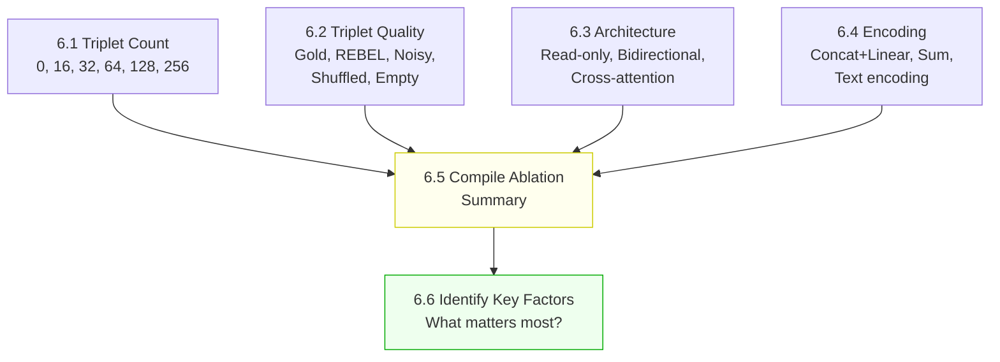

### Detailed Steps

Each ablation is a short training run (500-1000 steps, ~30 min each) followed by evaluation. We don't need full training — we need enough to see relative differences.

#### 6.1 Triplet Count Ablation

| Run | max_triplets | Expected Outcome |
|---|---|---|
| count_0 | 0 | Baseline equivalent (control) |
| count_16 | 16 | Minimal context — small improvement |
| count_32 | 32 | Moderate context |
| count_64 | 64 | Default — primary result |
| count_128 | 128 | Diminishing returns? |
| count_256 | 256 | VRAM stress test + saturation point |

**Plot:** BPB vs. max_triplets. Expected shape: monotonically decreasing, with diminishing returns.

#### 6.2 Triplet Quality Ablation

| Run | Description | Expected |
|---|---|---|
| quality_gold | Manually verified correct triplets (on small eval set) | Upper bound on triplet benefit |
| quality_rebel | Standard REBEL extraction | Normal result |
| quality_noisy_30 | 30% of triplets replaced with random | Degraded — how robust is the model? |
| quality_shuffled | Correct triplets from wrong documents | If ≈ REBEL: model doesn't read content. If worse: model reads content |
| quality_empty | All-zero triplets (PAD only) | Should ≈ baseline. If not, model uses positional signal from triplet slots |

**Critical comparison:** `quality_shuffled` vs `quality_rebel`. This is the **single most important ablation** — it distinguishes "model uses triplet content" from "model uses triplet positions as extra parameters."

#### 6.3 Architecture Ablation

| Run | Attention Mask | Description |
|---|---|---|
| arch_readonly | Default block-causal | Triplets don't attend to tokens |
| arch_bidirectional | Full attention everywhere | Triplets attend to everything |
| arch_crossattn | Cross-attention only | Tokens query triplets via separate cross-attention layer (HMT-style) |

#### 6.4 Encoding Ablation

| Run | Encoding Method | Description |
|---|---|---|
| enc_concat_linear | Default: concat + proj | Three embeddings concatenated, linearly projected |
| enc_sum | Average of three embeddings | Simpler but loses positional structure |
| enc_text | Encode triplet as text tokens | "(Biden, signed, Bill)" tokenized normally — uses no special architecture |

**The `enc_text` ablation is particularly important:** If encoding triplets as plain text tokens (with no TripletEncoder, no special attention mask) performs similarly to the structured approach, then the entire TripletEncoder architecture is unnecessary — you can just prepend text.

### Success Criteria

- [ ] All ablation runs completed
- [ ] Results compiled into comparison table
- [ ] Key factors identified and ranked by importance
- [ ] At least one ablation clearly distinguishes content-based from parameter-based effects

### Outputs

- `results/ablation_results.json` — All ablation metrics
- `results/ablation_analysis.md` — Written analysis with conclusions

---

## Phase 7: Analysis and Write-Up

### Rationale

**Why:** The experiment is only valuable if the results are clearly documented, honestly analyzed, and the conclusions are stated in terms of what was actually observed (not what we hoped to see).

This phase produces the final deliverable: a document that answers "Did triplet context compression work, and what did we learn?"

**What question does this answer?** "What are the complete findings, and what should happen next?"

### Prerequisites

- All phases 0-6 completed
- All metrics recorded
- All ablation results available

### Workflow

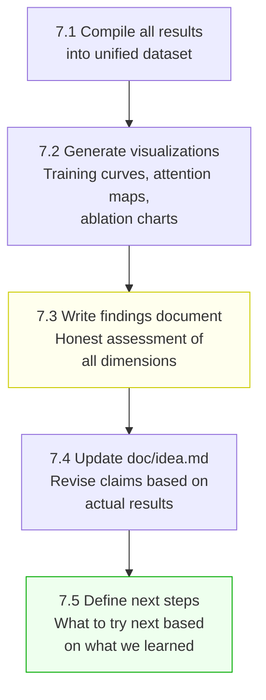

### Detailed Steps

#### 7.1 Compile Results

Collect all metrics into a single structured file:

```json
{
    "baseline": { "bpb": ..., "core": ..., "per_task": {...} },
    "triplet_v1": { "bpb": ..., "core": ..., "per_task": {...}, "utilization": ..., ... },
    "ablations": {
        "count": { "0": ..., "16": ..., "32": ..., "64": ..., "128": ..., "256": ... },
        "quality": { "gold": ..., "rebel": ..., "noisy": ..., "shuffled": ..., "empty": ... },
        "architecture": { "readonly": ..., "bidirectional": ..., "crossattn": ... },
        "encoding": { "concat_linear": ..., "sum": ..., "text": ... }
    },
    "evaluation": {
        "effective_context": ...,
        "hallucination": ...,
        "efficiency": ...,
        "composability": ...
    }
}
```

#### 7.2 Generate Visualizations

Required plots:
1. **Training loss curves:** Baseline vs. triplet model (overlay)
2. **BPB vs. max_triplets:** Ablation curve with error bars
3. **Attention heatmap:** Layer × head grid showing average attention to triplets
4. **Per-task CORE comparison:** Grouped bar chart (baseline vs. triplet per task)
5. **Quality ablation bar chart:** BPB for each quality condition

#### 7.3 Write Findings Document

**File:** `results/findings.md`

Structure:
1. **Executive Summary** — 1 paragraph: did it work?
2. **Quantitative Results** — Tables and charts
3. **What Worked** — Dimensions where triplets helped
4. **What Didn't Work** — Dimensions where triplets didn't help or hurt
5. **Ablation Insights** — What matters and what doesn't
6. **Failure Analysis** — If applicable, why the approach failed
7. **Comparison to Predictions** — How do results compare to Section 8.3 of theory doc?

**Honesty requirement:** If the experiment failed (triplets didn't help), say so clearly. Identify which failure mode from the risk analysis materialized, and what the evidence suggests about why.

#### 7.4 Update doc/idea.md

Revise the proposal document to reflect actual results:
- Update compression ratios with measured values
- Update "Core claim" with actual observed benefits
- Add "Experimental Results" section
- Revise risk assessments based on which risks materialized

#### 7.5 Define Next Steps

Based on results, one of three paths:

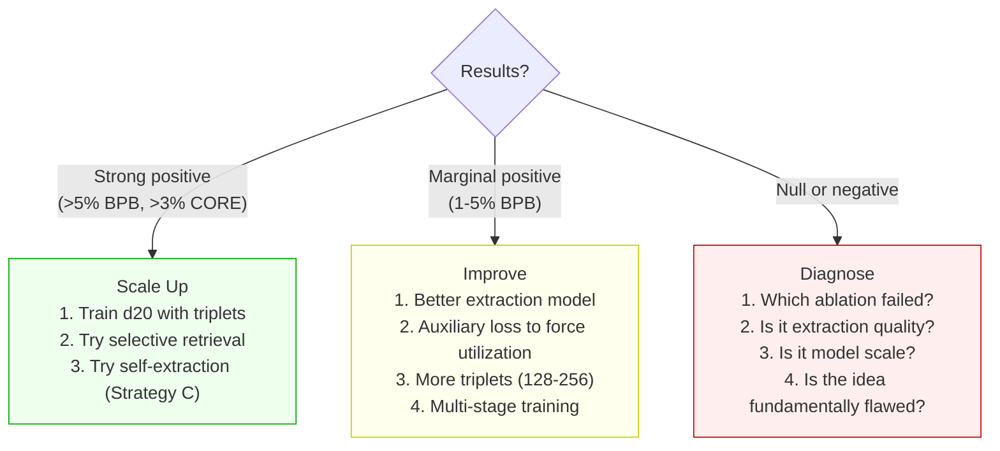

### Success Criteria

- [ ] All results compiled and verified
- [ ] Visualizations generated
- [ ] Findings document written with honest assessment
- [ ] doc/idea.md updated
- [ ] Next steps defined and justified
- [ ] All code, data, and results committed to repository

### Outputs

- `results/all_results.json` — Complete results dataset
- `results/findings.md` — Written analysis
- `results/plots/` — Visualization files
- Updated `doc/idea.md`
- Git commit with all experiment artifacts

---

## Appendix A: Complete File Change List

| File | Phase | Change Type | Lines Changed |
|---|---|---|---|
| `nanochat/gpt.py` | 2 | Modify | ~150 (TripletEncoder, GPTConfig, forward, attention) |
| `nanochat/dataloader.py` | 3 | Modify | ~100 (triplet_augmented_data_loader) |
| `scripts/base_train.py` | 4 | Modify | ~50 (CLI args, training loop wiring) |
| `scripts/triplet_extract.py` | 1 | **New** | ~200 (extraction pipeline) |
| `scripts/triplet_eval.py` | 5 | **New** | ~300 (evaluation suite) |
| `tests/test_triplet_encoder.py` | 2 | **New** | ~80 (unit tests) |
| `results/` | 0-7 | **New dir** | Various JSON/MD result files |

**Total: ~880 lines of new/modified code**

## Appendix B: Dependency Graph

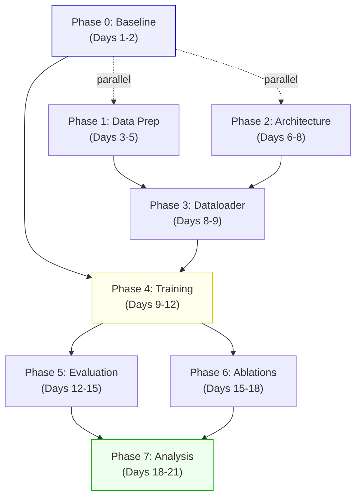

**Key insight:** Phases 0, 1, and 2 can run in parallel. Phase 3 requires both 1 and 2. Phase 4 requires 0 and 3. This means the critical path is: **0 → 3 → 4 → 5/6 → 7**, with 1 and 2 running alongside 0.
