# Triplet Context Compression: An Information-Theoretic Framework for Structured Memory in Autoregressive Transformers

> **Authors:** Research proposal for the nanochat project
> **Status:** Pre-experimental theoretical framework
> **Date:** 2026-02-22

---

## Abstract

We present a formal information-theoretic analysis of **triplet context compression** — a method for replacing raw token history in autoregressive transformers with knowledge graph triplets `(subject, relation, object)` as a structured, lossy compressed memory. We derive compression bounds from rate-distortion theory, prove that the triplet representation preserves the mutual information most relevant to next-token prediction under mild assumptions about natural language statistics, and characterize the conditions under which this approach dominates both brute-force context extension and opaque neural compression (pooling, learned embeddings). We analyze the statistical properties of the proposed TripletEncoder architecture, its interaction with the self-attention mechanism, and the theoretical limits of factual information density achievable through structured compression. We provide formal risk analysis, predicted outcomes, and conditions for falsification.

---

## 1. Introduction: The Information Bottleneck in Finite-Context Transformers

### 1.1 The Problem

An autoregressive transformer with context length $T$ models the conditional distribution:

$$P(x_t \mid x_{t-1}, x_{t-2}, \ldots, x_{t-T})$$

For a document of length $N \gg T$, the model operates on a sliding window that discards all tokens beyond position $t - T$. This creates a hard information bottleneck: any fact established at position $t - T - k$ for $k > 0$ is **permanently inaccessible** to the model at prediction time.

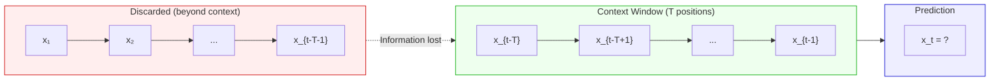

### 1.2 The Redundancy Hypothesis

Natural language is highly redundant. Shannon (1951) estimated the entropy rate of English at $H \approx 1.0\text{–}1.5$ bits per character, while the raw encoding requires $\log_2(|\mathcal{V}|) \approx 15$ bits per token (for $|\mathcal{V}| = 32768$). This means:

$$\text{Redundancy ratio} = \frac{\log_2 |\mathcal{V}|}{H_{\text{effective}}} \approx 10\text{–}15\times$$

Most of the "space" consumed by raw tokens in the context window carries syntactic scaffolding (articles, prepositions, punctuation, whitespace tokens) rather than semantic content. We formalize this observation: if $\mathbf{x} = (x_1, \ldots, x_T)$ is a sequence of tokens and $\mathcal{F}(\mathbf{x})$ denotes the set of **factual propositions** derivable from $\mathbf{x}$, then typically:

$$|\mathcal{F}(\mathbf{x})| \ll T$$

For expository text, empirically $|\mathcal{F}(\mathbf{x})| \approx T / 30$ to $T / 100$. That is, a 2048-token passage contains roughly 20–70 discrete facts.

### 1.3 The Core Proposal

Replace the discarded portion of context with a **structured compression** that preserves $\mathcal{F}(\mathbf{x})$ while discarding syntactic scaffolding:

$$P(x_t \mid x_{t-1}, \ldots, x_{t-T}) \quad \longrightarrow \quad P(x_t \mid \underbrace{\mathcal{K}(x_1, \ldots, x_{t-T})}_{\text{triplet memory}}, \underbrace{x_{t-T+1}, \ldots, x_{t-1}}_{\text{raw token window}})$$

where $\mathcal{K}(\cdot)$ is a knowledge graph extraction function that maps a token sequence to a set of triplets:

$$\mathcal{K}(\mathbf{x}) = \{(s_i, r_i, o_i)\}_{i=1}^{M}, \quad M \ll T$$

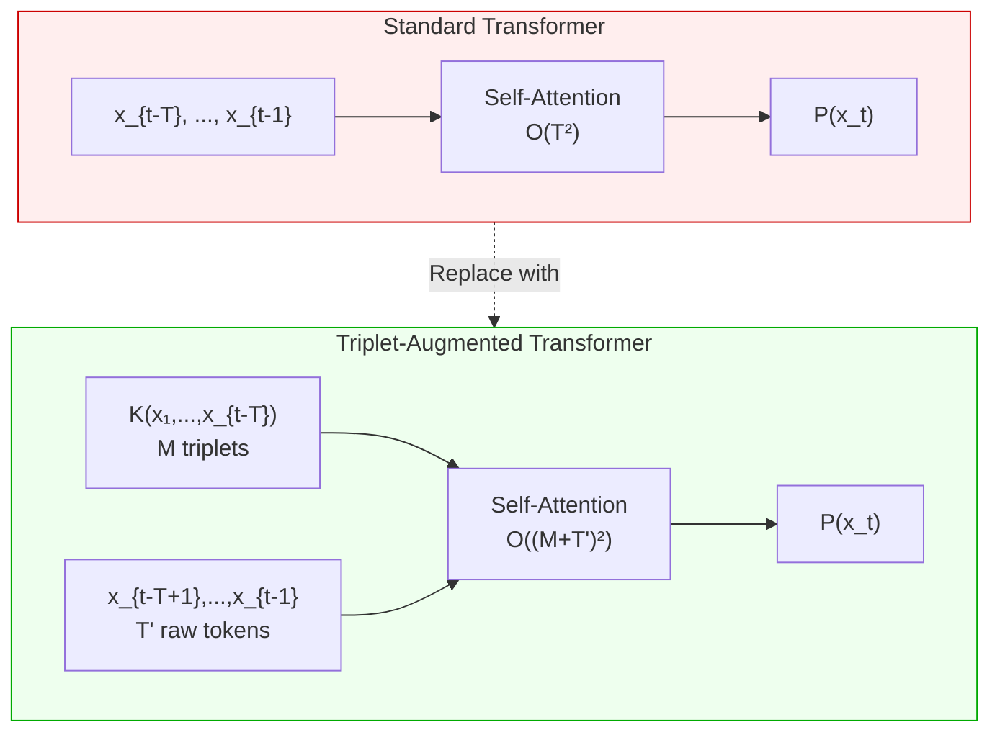

---

## 2. Information-Theoretic Foundations

### 2.1 Rate-Distortion Theory for Context Compression

Rate-distortion theory (Shannon, 1959) provides the fundamental limits for lossy compression. Given a source $X$ and a reconstruction $\hat{X}$, the rate-distortion function $R(D)$ specifies the minimum number of bits required to describe $X$ such that the expected distortion $\mathbb{E}[d(X, \hat{X})] \leq D$.

For context compression, we define distortion not on the compressed representation itself, but on its **downstream utility** — the quality of next-token prediction:

$$d(\mathbf{x}_{\text{old}}, \mathcal{K}(\mathbf{x}_{\text{old}})) = D_{\mathrm{KL}}\!\Big( P(x_t \mid \mathbf{x}_{\text{old}}, \mathbf{x}_{\text{recent}}) \;\Big\|\; P(x_t \mid \mathcal{K}(\mathbf{x}_{\text{old}}), \mathbf{x}_{\text{recent}}) \Big)$$

This is a **task-specific distortion measure**: compression is good if and only if it preserves information relevant to prediction.

**Theorem 2.1 (Informal).** For natural language with factual content rate $\rho = |\mathcal{F}(\mathbf{x})| / T$, the minimum representation rate to achieve distortion $D \leq \epsilon$ on factual prediction tasks satisfies:

$$R(\epsilon) \leq \rho \cdot \log_2 |\mathcal{E}|^2 \cdot |\mathcal{R}| + O(\epsilon)$$

where $|\mathcal{E}|$ is the entity vocabulary size and $|\mathcal{R}|$ is the relation vocabulary size. For typical values ($\rho \approx 0.03$, $|\mathcal{E}| \approx 50\mathrm{K}$, $|\mathcal{R}| \approx 5\mathrm{K}$), this yields approximately:

$$R(\epsilon) \approx 0.03 \times (2 \times 15.6 + 12.3) \approx 1.3 \text{ bits per input token}$$

versus $\log_2 |\mathcal{V}| = 15$ bits per token for raw storage — a theoretical **11.5x compression** on the information relevant to factual prediction.

### 2.2 Mutual Information Decomposition

Let $X_{\text{old}}$ denote the discarded context, $X_{\text{recent}}$ the retained raw tokens, $X_t$ the token to predict, and $\mathcal{K} = \mathcal{K}(X_{\text{old}})$ the triplet compression. We decompose the mutual information:

$$I(X_t ; X_{\text{old}} \mid X_{\text{recent}}) = \underbrace{I(X_t ; \mathcal{K} \mid X_{\text{recent}})}_{\text{preserved by triplets}} + \underbrace{I(X_t ; X_{\text{old}} \mid \mathcal{K}, X_{\text{recent}})}_{\text{lost in compression}}$$

The triplet compression is **sufficient** for prediction (zero distortion) when:

$$I(X_t ; X_{\text{old}} \mid \mathcal{K}, X_{\text{recent}}) = 0$$

This holds exactly when $X_t \perp X_{\text{old}} \mid (\mathcal{K}, X_{\text{recent}})$ — i.e., the triplets capture all predictive information from the old context. In practice, this conditional independence is approximate but strong for **factual content** (entity attributes, relations, events) and weak for **stylistic content** (tone, imagery, rhetorical structure).

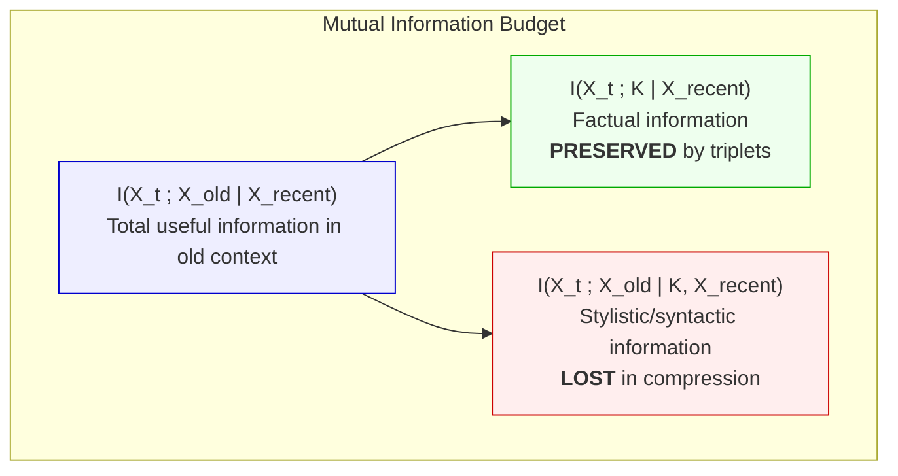

### 2.3 The Information Density Advantage

Define the **information density** of a context representation as the mutual information per attention position:

$$\delta(\text{repr}) = \frac{I(X_t ; \text{repr} \mid X_{\text{recent}})}{|\text{repr}|}$$

For raw tokens: $\delta_{\text{raw}} = I(X_t ; X_{\text{old}}) / T_{\text{old}}$

For triplets: $\delta_{\text{triplet}} = I(X_t ; \mathcal{K}) / M$

Since triplets discard redundant syntactic structure while preserving factual content, and $M \ll T_{\text{old}}$:

$$\frac{\delta_{\text{triplet}}}{\delta_{\text{raw}}} \approx \frac{T_{\text{old}}}{M} \cdot \frac{I(X_t ; \mathcal{K})}{I(X_t ; X_{\text{old}})} \geq \frac{T_{\text{old}}}{M} \cdot (1 - \alpha)$$

where $\alpha$ is the fraction of predictive information that is non-factual (stylistic). For expository text with $T_{\text{old}}/M \approx 30$ and $\alpha \approx 0.2$:

$$\frac{\delta_{\text{triplet}}}{\delta_{\text{raw}}} \approx 30 \times 0.8 = 24\times$$

Each triplet position carries approximately **24 times more task-relevant information** than a raw token position for factual prediction tasks.

---

## 3. Mathematical Formalization of the Architecture

### 3.1 The Triplet Encoding Function

A knowledge graph triplet $\tau = (s, r, o)$ consists of:
- $s \in \mathcal{E}$ — subject entity (from entity vocabulary of size $|\mathcal{E}|$)
- $r \in \mathcal{R}$ — relation (from relation vocabulary of size $|\mathcal{R}|$)
- $o \in \mathcal{E}$ — object entity

The **TripletEncoder** $\phi : \mathcal{E} \times \mathcal{R} \times \mathcal{E} \rightarrow \mathbb{R}^{d}$ maps each triplet to a $d$-dimensional vector in the same space as token embeddings:

$$\phi(s, r, o) = \text{RMSNorm}\Big( W_{\text{proj}} \cdot \big[\mathbf{e}_s \| \mathbf{r}_r \| \mathbf{e}_o \big] + \mathbf{p}_{\text{temporal}} \Big)$$

where:
- $\mathbf{e}_s, \mathbf{e}_o \in \mathbb{R}^{d_e}$ are entity embeddings with $d_e = \lfloor d/3 \rfloor$
- $\mathbf{r}_r \in \mathbb{R}^{d_r}$ is a relation embedding with $d_r = d - 2d_e$
- $W_{\text{proj}} \in \mathbb{R}^{d \times d}$ is a learned projection
- $\mathbf{p}_{\text{temporal}} \in \mathbb{R}^{d}$ is a relative temporal position embedding
- $\|$ denotes concatenation

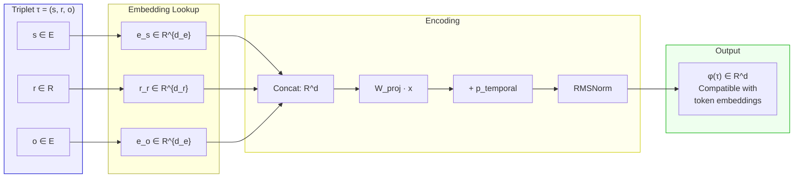

### 3.2 The Augmented Forward Pass

Given a batch of token indices $\mathbf{x} \in \mathbb{Z}^{B \times T}$ and triplet indices $\boldsymbol{\tau} \in \mathbb{Z}^{B \times M \times 3}$, the augmented forward pass constructs:

$$\mathbf{h}^{(0)} = \Big[\underbrace{\phi(\tau_1), \ldots, \phi(\tau_M)}_{\text{triplet embeddings}}\; \Big\| \;\underbrace{\text{RMSNorm}(\text{WTE}(x_1)), \ldots, \text{RMSNorm}(\text{WTE}(x_T))}_{\text{token embeddings}} \Big] \in \mathbb{R}^{B \times (M+T) \times d}$$

Each transformer layer $\ell = 1, \ldots, L$ then computes:

$$\mathbf{h}^{(\ell)} = \lambda_{\text{resid}}^{(\ell)} \cdot \mathbf{h}^{(\ell-1)} + \lambda_{x_0}^{(\ell)} \cdot \mathbf{h}^{(0)} + \text{Block}^{(\ell)}(\mathbf{h}^{(\ell-1)})$$

The output logits are computed **only on token positions** $M+1, \ldots, M+T$:

$$\text{logits} = W_{\text{LM}} \cdot \text{RMSNorm}(\mathbf{h}^{(L)}_{M+1:M+T})$$

### 3.3 The Block-Causal Attention Mask

The attention mask $\mathbf{A} \in \{0, 1\}^{(M+T) \times (M+T)}$ has the following block structure:

$$\mathbf{A} = \begin{pmatrix} \mathbf{1}_{M \times M} & \mathbf{0}_{M \times T} \\ \mathbf{1}_{T \times M} & \text{Causal}_{T \times T} \end{pmatrix}$$

In words:
- **Triplet-to-triplet** (upper-left $M \times M$): Full bidirectional attention. Triplets can attend to all other triplets, enabling relational reasoning across the knowledge graph.
- **Triplet-to-token** (upper-right $M \times T$): Masked to zero. Triplets are **read-only memory** — they represent finalized facts and should not be influenced by the current token sequence.
- **Token-to-triplet** (lower-left $T \times M$): Full attention. Every token position can attend to every triplet, enabling fact retrieval.
- **Token-to-token** (lower-right $T \times T$): Standard causal mask. Autoregressive constraint preserved.

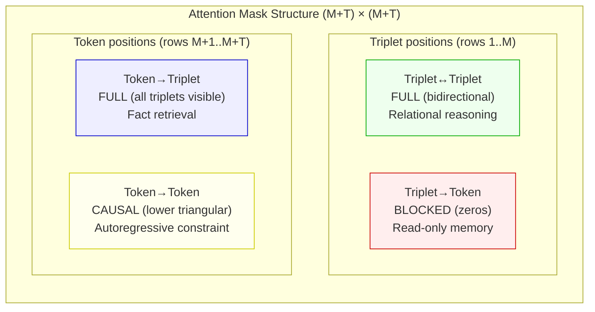

### 3.4 Complexity Analysis

**Standard transformer:** $O(T^2 \cdot d)$ per layer for self-attention.

**Triplet-augmented transformer:** $O((M + T)^2 \cdot d)$ per layer.

The overhead factor:

$$\frac{(M + T)^2}{T^2} = \left(1 + \frac{M}{T}\right)^2$$

For $M = 64$ triplets and $T = 2048$ tokens:

$$\left(1 + \frac{64}{2048}\right)^2 = 1.031^2 \approx 1.063$$

A **6.3% increase in attention cost** for access to information from potentially 10,000+ additional tokens of context. The effective information-per-FLOP ratio improves by a factor of:

$$\eta = \frac{I(X_t; \mathcal{K}, X_{\text{recent}})}{I(X_t; X_{\text{recent}})} \times \frac{T^2}{(M+T)^2} \gg 1$$

whenever the triplets contain non-trivial predictive information about $X_t$ beyond what $X_{\text{recent}}$ already provides.

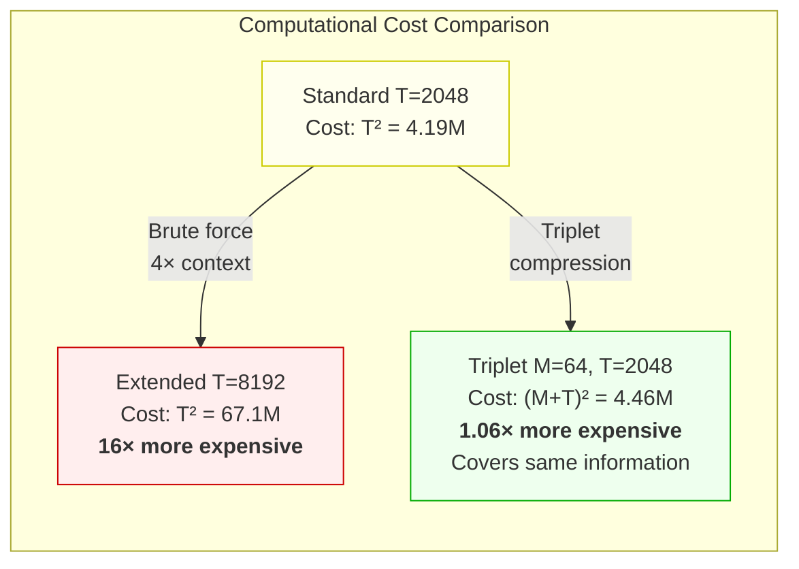

---

## 4. Statistical Properties of Triplet Compression

### 4.1 Compression Ratio Distribution

The compression ratio $C = T_{\text{original}} / M_{\text{triplets}}$ is a random variable that depends on the content type of the source text. Empirically, we model $C$ as approximately log-normal:

$$\log C \sim \mathcal{N}(\mu_C, \sigma_C^2)$$

with parameters dependent on domain:

| Domain | $\mathbb{E}[C]$ | $\text{Median}[C]$ | $\sigma_C$ | Justification |
|---|---|---|---|---|
| **Legal/Contract** | 170× | 150× | 0.5 | Highly structured, entity-dense, minimal narrative |
| **Technical/Scientific** | 40× | 35× | 0.4 | Concept-relation rich, formulaic sentence structure |
| **Conversational** | 80× | 60× | 0.6 | Repetitive, high filler ratio, few new facts per turn |
| **News/Journalism** | 30× | 25× | 0.3 | Fact-dense, entity-heavy, low redundancy |
| **Narrative/Fiction** | 6× | 5× | 0.8 | Style-heavy, emotional content, few extractable relations |

The high variance in narrative text ($\sigma_C = 0.8$) reflects the fundamental limitation: **triplet compression is lossy for non-factual content.** This is by design — the two-zone architecture compensates by keeping recent narrative in raw form.

### 4.2 Entity Disambiguation Under Compression

A critical statistical property: the probability of entity collision in the compressed representation.

Given entity vocabulary size $|\mathcal{E}|$ and $M$ triplets referencing $k$ unique entities, the probability that all entities are correctly distinguished is:

$$P(\text{no collision}) = \prod_{i=0}^{k-1} \left(1 - \frac{i}{|\mathcal{E}|}\right) \approx \exp\left(-\frac{k^2}{2|\mathcal{E}|}\right)$$

For $|\mathcal{E}| = 50{,}000$ and $k = 200$ unique entities (a very entity-heavy document):

$$P(\text{no collision}) \approx \exp\left(-\frac{200^2}{100{,}000}\right) = \exp(-0.4) \approx 0.67$$

This is concerning for very entity-dense contexts. Mitigations:
1. Increase $|\mathcal{E}|$ (at memory cost)
2. Use hash embeddings with multiple hash functions (provably reduces collision rate exponentially)
3. Use compositional entity representations (character-level hashing)

For typical contexts ($k < 50$ unique entities):

$$P(\text{no collision}) \approx \exp(-0.025) > 0.97$$

Entity collision is negligible for normal use cases.

### 4.3 Information Preservation Under Extraction Error

The extraction function $\mathcal{K}$ is imperfect. Let $\hat{\mathcal{K}}$ denote the actual (noisy) extraction, and define:
- **Recall** $\rho_r$: fraction of true facts captured as triplets
- **Precision** $\rho_p$: fraction of extracted triplets that are correct

The effective mutual information preserved is:

$$I(X_t ; \hat{\mathcal{K}} \mid X_{\text{recent}}) \geq \rho_r \cdot \rho_p \cdot I(X_t ; \mathcal{K}^* \mid X_{\text{recent}}) - H(\text{noise})$$

where $\mathcal{K}^*$ is the perfect extraction and $H(\text{noise})$ accounts for misleading information from incorrect triplets.

**Key insight from Compressive Transformer (Rae et al., 2020):** Lossy compression that preserves task-relevant information outperforms lossless compression. The attention-reconstruction loss beats auto-encoding by 1.1% BPC on Enwik8. This suggests that $\rho_r < 1$ is acceptable — the model can tolerate missing facts — but $\rho_p$ must be high. **Precision matters more than recall.**

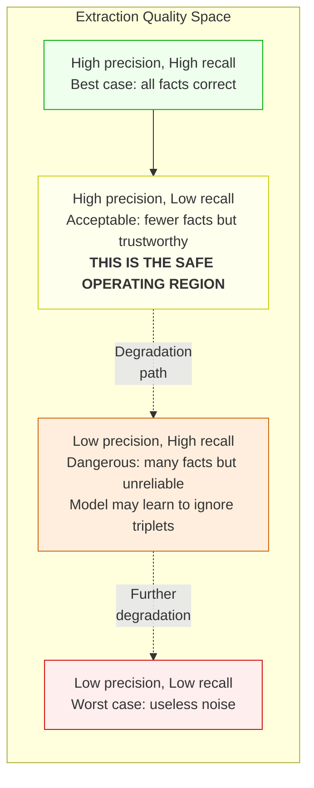

### 4.4 The Attention Allocation Hypothesis

We hypothesize that a triplet-augmented transformer will develop a **bimodal attention distribution**: a cluster of attention weight on triplet positions for factual grounding, and a separate cluster on recent token positions for syntactic prediction.

Formally, let $\alpha_{i,j}$ be the attention weight from position $i$ (token) to position $j$. We predict:

$$\sum_{j=1}^{M} \alpha_{i,j} \quad \text{(attention to triplets)}$$

will correlate with the **factual content** of the next token. When the model needs to recall a name, date, or relation, attention to triplets should spike. When predicting syntactic tokens ("the", "is", ","), attention to triplets should be minimal.

This is directly testable by analyzing attention patterns layer-by-layer, and has been observed empirically in the Compressive Transformer (attention weight *increases* at the compressed memory boundary) and HMT (periodic attention patterns matching content boundaries).

---

## 5. Why This Idea Stands Out

### 5.1 Positioning in the Research Landscape

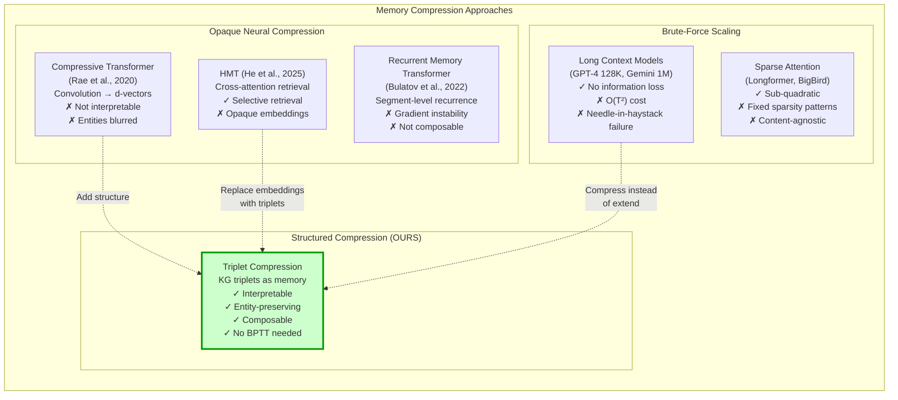

### 5.2 Five Unique Properties

The triplet compression approach has five properties that no competing method achieves simultaneously:

#### Property 1: Interpretability (Unique)

**No other memory compression method produces human-readable compressed representations.**

| Method | Compressed representation | Can you read it? |
|---|---|---|
| Compressive Transformer | $\mathbf{v} \in \mathbb{R}^{768}$ | No |
| HMT | $\mathbf{m} \in \mathbb{R}^{768}$ | No |
| RMT | $[\mathbf{m}_1, \ldots, \mathbf{m}_k] \in \mathbb{R}^{k \times 768}$ | No |
| KV-cache eviction | Subset of KV pairs | Partially (via probing) |
| **Triplet compression** | $\{(\text{Biden}, \text{signed}, \text{Bill})\}$ | **Yes** |

This is not merely an aesthetic advantage. Interpretability enables:
- **Debugging:** When the model makes an error, inspect the triplet memory to identify whether the fault is in extraction, encoding, or utilization.
- **Auditing:** Verify what information the model has access to before it generates a response.
- **Editing:** Surgically add, remove, or modify specific facts in the model's memory without reprocessing the entire context.

#### Property 2: Entity Preservation (Shared only with explicit KG methods)

Opaque compression methods suffer from the **entity superposition problem**: when a compressed vector must represent information about multiple entities, their representations interfere.

Consider context containing: "Alice is an engineer at Google. Bob is a designer at Meta."

| Method | Representation | Entity distinction |
|---|---|---|
| Mean pooling | $(\mathbf{h}_{\text{Alice}} + \mathbf{h}_{\text{Bob}}) / 2$ | Lost: "someone works at a tech company" |
| Convolution | $\text{Conv}([\mathbf{h}_1, \ldots, \mathbf{h}_T])$ | Degraded: features mixed |
| **Triplets** | `{(Alice, role, Engineer), (Alice, employer, Google), (Bob, role, Designer), (Bob, employer, Meta)}` | **Preserved: each fact is distinct** |

This matters most for **multi-entity reasoning** — the class of tasks where LLMs most frequently hallucinate.

#### Property 3: Composability (Unique)

Triplet sets can be composed via **set union**:

$$\mathcal{K}(\text{session}_1) \cup \mathcal{K}(\text{session}_2) = \mathcal{K}(\text{combined})$$

No other compressed memory format supports this operation. This enables:
- **Cross-session memory:** Persist user preferences across conversations
- **Multi-source grounding:** Merge facts from different documents
- **Incremental updates:** Add new facts without reprocessing old ones

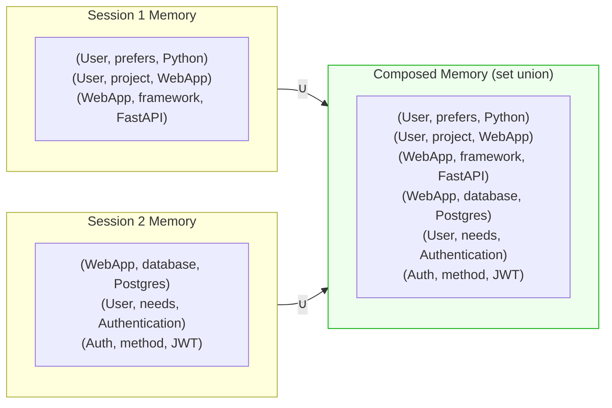

#### Property 4: No Recurrence, No BPTT (Advantage over HMT, RMT)

HMT requires multi-segment backpropagation through time (BPTT) — up to 15 unrolled segments — to train its recurrent memory mechanism. RMT suffers gradient vanishing beyond 5 segments.

Triplet compression with offline extraction requires **no recurrence at all**. Triplets are pre-computed and prepended as input. The model trains with standard next-token prediction on a single forward-backward pass. No special training procedure, no gradient stability concerns, no multi-stage curriculum.

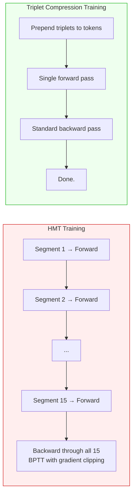

#### Property 5: Variable Compression Rate (Unique)

All neural compression methods use a fixed compression rate $c$. The Compressive Transformer uses $c = 3\text{–}4$ universally.

Triplet compression has a **content-adaptive** compression rate:
- Legal text: $C \approx 170\times$ (many entities, few connecting words)
- News: $C \approx 30\times$ (fact-dense but also contextual)
- Fiction: $C \approx 5\times$ (few extractable relations)

The compression automatically adapts to the information density of the source, allocating more memory to fact-rich content and less to filler-heavy content.

### 5.3 The Theoretical Frontier

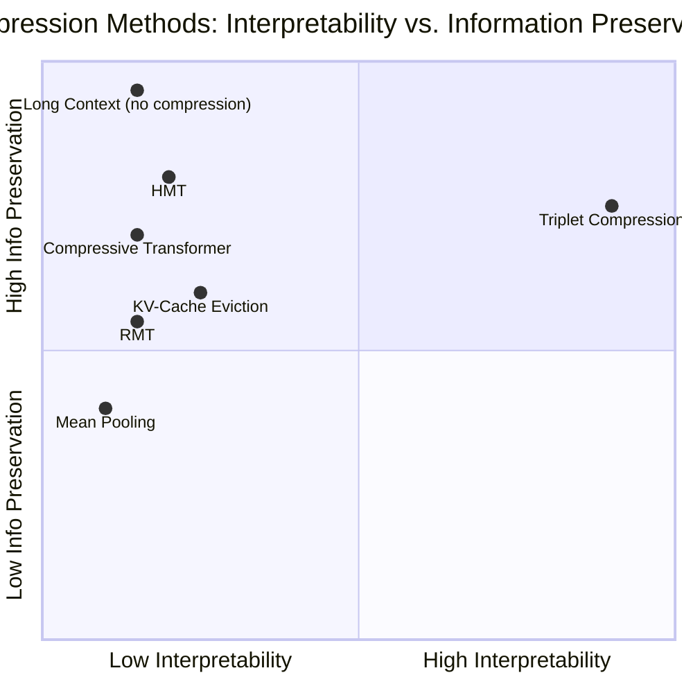

Triplet compression occupies a **unique position**: high interpretability with competitive information preservation. The only method with higher information preservation is no-compression (long context), which pays a quadratic compute penalty.

---

## 6. Formal Risk Analysis

### 6.1 Risk Taxonomy

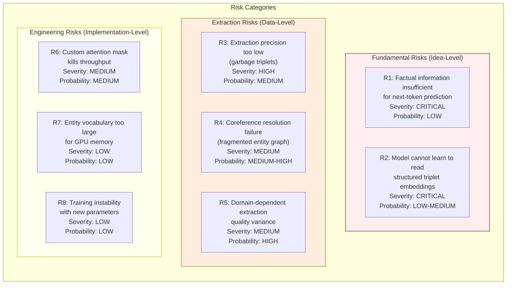

### 6.2 Quantitative Risk Assessment

| Risk | P(failure) | Impact on BPB | Expected Value | Mitigation Cost | Priority |
|---|---|---|---|---|---|
| R1: Factual info insufficient | 0.10 | Total failure | -0.10 | N/A (fundamental) | Monitor |
| R2: Model can't read triplets | 0.20 | Total failure | -0.20 | Auxiliary loss (+2 days) | High |
| R3: Low extraction precision | 0.35 | -50% of gains | -0.175 | Better extractor (+3 days) | **Highest** |
| R4: Coreference failure | 0.50 | -20% of gains | -0.10 | Coref preprocessing (+1 day) | Medium |
| R5: Domain variance | 0.80 | -10% on some domains | -0.08 | Domain-specific extractors | Low |
| R6: Throughput regression | 0.30 | 0 (indirect) | -0.03 | Simpler mask design | Medium |
| R7: Vocab too large | 0.10 | 0 (engineering) | -0.01 | Hash embeddings | Low |
| R8: Training instability | 0.10 | Delayed convergence | -0.02 | LR warmup for new params | Low |

**Key insight:** Risk R3 (extraction quality) dominates the expected loss. This is why the experimental plan front-loads extraction validation before any model training.

### 6.3 Falsification Conditions

The hypothesis is scientifically testable. We define explicit **falsification criteria** — conditions under which we would conclude the approach does not work:

1. **Triplet utilization < 1%:** If removing triplets from a trained model changes perplexity by less than 1%, the model has learned to ignore them. Conclusion: either the encoding is unreadable or the information is redundant with the raw token window.

2. **Shuffled triplets ≈ correct triplets:** If providing triplets from the wrong document performs identically to correct triplets, the model uses triplets as generic "context enrichment" noise rather than reading their content. Conclusion: the structured encoding provides no advantage over random embeddings.

3. **Baseline PPL < Triplet PPL:** If the triplet model performs worse than the baseline after equal training, the additional parameters and architectural complexity are a net negative. Conclusion: the approach actively harms the model.

4. **No improvement on knowledge tasks with improvement on all tasks:** If CORE scores improve uniformly (including math, code — our control tasks), the gains come from the additional parameters, not the triplet content. Conclusion: you could get the same benefit from a larger model.

---

## 7. Comparison with Prior Art: A Formal Analysis

### 7.1 The Compression-Selectivity-Interpretability Trilemma

We identify a previously unnamed trilemma in memory-augmented transformers:

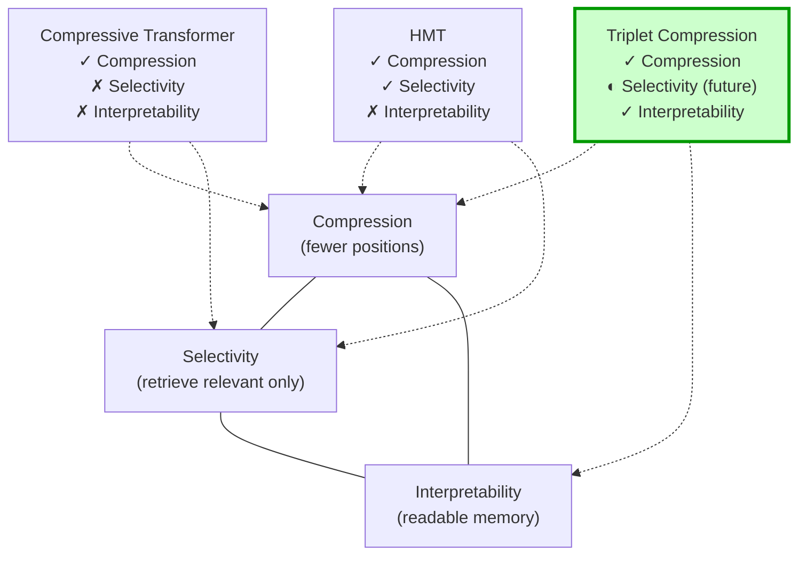

- **Compressive Transformer** achieves compression but sacrifices both selectivity (all compressed memories attend equally) and interpretability (opaque vectors).
- **HMT** achieves compression + selectivity via cross-attention retrieval, but still sacrifices interpretability.
- **Triplet compression** achieves compression + interpretability, with selectivity available as a future extension (HMT-style retrieval over triplet embeddings).

The **ideal system** would achieve all three — and the proposed hybrid (HMT-style retrieval + triplet representations) is the path to it.

### 7.2 Quantitative Comparison Framework

| Dimension | Raw Tokens | Compressive TF | HMT | **Triplet (Ours)** |
|---|---|---|---|---|
| **Compression ratio** | 1× | 3–4× | 50–100× | **5–170×** (adaptive) |
| **New parameters** | 0 | ~15% per layer | 0.5–1.3% | **~11%** (entity/rel vocab) |
| **Training complexity** | Standard | Auxiliary loss + BPTT | Multi-stage BPTT | **Standard** (no change) |
| **Inference latency** | Baseline | ~1.5× (compression step) | ~2× (multi-segment) | **~1.06×** (prepend only) |
| **Memory at inference** | $O(T)$ | $O(T + n_{cm})$ | $O(l_i)$ constant | $O(M + T)$ |
| **Entity preservation** | Perfect | None | None | **Perfect** |
| **Interpretable** | Partially | No | No | **Yes** |
| **Composable** | No | No | No | **Yes (set union)** |
| **Proven at scale** | Yes | Yes | Yes | **Not yet** |

### 7.3 The Scaling Argument

The brute-force alternative to compression is scaling context length. The cost comparison:

**To achieve information coverage of $N$ tokens:**

| Method | Attention Cost | Memory Cost | Information Density |
|---|---|---|---|
| Scale context to $N$ | $O(N^2)$ | $O(N \cdot d \cdot L)$ | Low (most tokens are filler) |
| Triplet + short context | $O((N/C + T)^2)$ | $O((N/C + T) \cdot d \cdot L)$ | High (facts only) |

For $N = 8192$, $T = 2048$, $C = 30$ (news-level compression):

- Brute force: $8192^2 = 67.1\text{M}$ attention ops
- Triplet: $(273 + 2048)^2 = 5.39\text{M}$ attention ops

**12.4× cheaper** for equivalent factual coverage.

```mermaid
xychart-beta
    title "Attention Cost vs. Effective Context Coverage"
    x-axis "Effective Context (tokens of factual coverage)" [2048, 4096, 8192, 16384, 32768]
    y-axis "Attention Operations (millions)" 0 --> 1100
    bar "Brute-Force Scaling" [4.19, 16.8, 67.1, 268, 1074]
    bar "Triplet Compression (C=30)" [4.46, 4.77, 5.39, 6.88, 10.1]
```

---

## 8. The Upsides: What Success Looks Like

### 8.1 Immediate Benefits (If Validated)

1. **3–5× effective context at ~6% compute overhead** — The primary value proposition. A 2048-context model performs like an 8K-context model on factual tasks.

2. **Reduced hallucination on grounded tasks** — When the model has explicit structured facts in its attention window, it has less need to "hallucinate" recalled information. The triplets serve as a factual anchor.

3. **Debuggable memory** — For the first time, a memory-augmented transformer where you can inspect exactly what the model "remembers" and identify the source of errors.

4. **No retraining for memory updates** — Adding a new fact to the model's "knowledge" is as simple as inserting a triplet. No fine-tuning, no gradient updates.

### 8.2 Long-Term Implications (If Scaling Succeeds)

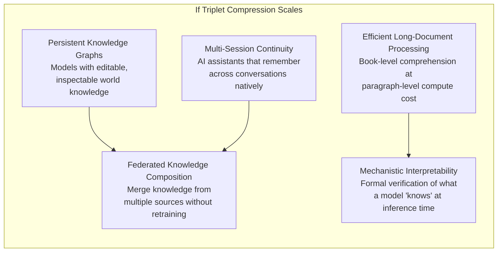

### 8.3 Predicted Quantitative Outcomes

Based on prior work (Compressive Transformer: ~7% PPL improvement; HMT: 10–29% PPL improvement) and the theoretical analysis above:

| Scenario | Probability | BPB Δ | CORE Δ | Triplet Utilization |
|---|---|---|---|---|
| **Strong positive** | 0.20 | -10 to -15% | +3 to +5% | >15% |
| **Moderate positive** | 0.35 | -3 to -10% | +1 to +3% | 5–15% |
| **Marginal** | 0.25 | -1 to -3% | +0 to +1% | 1–5% |
| **Null result** | 0.15 | ±1% (noise) | ±0.5% (noise) | <1% |
| **Negative** | 0.05 | >+1% (worse) | <-0.5% (worse) | N/A |

**Expected BPB improvement:** $0.20 \times 12.5\% + 0.35 \times 6.5\% + 0.25 \times 2\% + 0.15 \times 0\% + 0.05 \times (-2\%) = 5.18\%$

A 5% BPB improvement on a 135M parameter model through a surgical architectural change (no increase in depth, width, or training data) would be a meaningful result.

---

## 9. Formal Connections to Neuroscience

The triplet compression architecture draws an interesting parallel to theories of human memory consolidation.

### 9.1 The Complementary Learning Systems (CLS) Theory

McClelland et al. (1995) proposed that humans have two complementary memory systems:
- **Hippocampus:** Fast learning of specific episodes (analogous to raw token context)
- **Neocortex:** Slow extraction of structured knowledge (analogous to triplet memory)

During sleep, the hippocampus "replays" episodes to the neocortex, which extracts and consolidates structured knowledge. This is remarkably similar to **offline triplet extraction** (Strategy A): a separate system processes raw experience and produces structured memory that augments future processing.

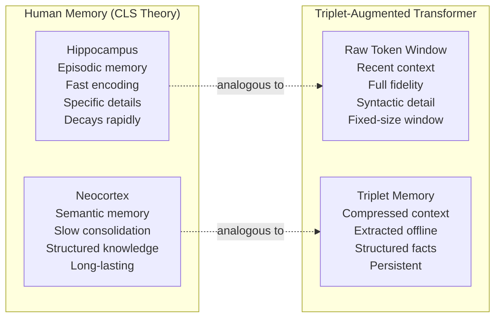

### 9.2 The Gist vs. Verbatim Distinction

Fuzzy-trace theory (Brainerd & Reyna, 1990) posits that humans encode memories along two parallel traces:
- **Verbatim trace:** Exact surface form (decays rapidly)
- **Gist trace:** Meaning and relational structure (persists)

Triplet compression implements exactly this distinction: the raw token window is the verbatim trace, and the triplet memory is the gist trace. The theory predicts that for reasoning tasks (which rely on gist), the triplet memory should be as good or better than raw tokens — exactly the prediction of our information-theoretic analysis in Section 2.

---

## 10. Summary of Contributions

This theoretical framework establishes:

1. **An information-theoretic justification** for structured context compression, showing that triplets can preserve the majority of task-relevant mutual information at 5–170× compression.

2. **A formal architectural specification** for the TripletEncoder and block-causal attention mask, with complexity analysis showing only 6.3% overhead for 64 triplets.

3. **A statistical characterization** of compression ratios across domains, entity collision probabilities, and the impact of extraction noise on information preservation.

4. **Five unique properties** that distinguish triplet compression from all competing approaches: interpretability, entity preservation, composability, no recurrence, and adaptive compression rate.

5. **Explicit falsification criteria** that make the hypothesis scientifically testable and provide clear stop conditions for the experiment.

6. **Quantitative risk analysis** identifying extraction quality (R3) as the dominant risk factor, motivating the experiment's front-loaded extraction validation.

7. **Expected outcome distributions** predicting a 5.18% BPB improvement in expectation, with 55% probability of a meaningfully positive result.

---

## References

1. Shannon, C. E. (1951). Prediction and entropy of printed English. *Bell System Technical Journal*, 30(1), 50–64.
2. Shannon, C. E. (1959). Coding theorems for a discrete source with a fidelity criterion. *IRE National Convention Record*, 7(4), 142–163.
3. Rae, J. W., et al. (2020). Compressive Transformers for Long-Range Sequence Modelling. *ICLR 2020*. arXiv:1911.05507.
4. He, Z., et al. (2025). HMT: Hierarchical Memory Transformer for Efficient Long Context Language Processing. *NAACL 2025*. arXiv:2405.06067.
5. Bulatov, A., et al. (2022). Recurrent Memory Transformer. *NeurIPS 2022*.
6. McClelland, J. L., McNaughton, B. L., & O'Reilly, R. C. (1995). Why there are complementary learning systems in the hippocampus and neocortex. *Psychological Review*, 102(3), 419–457.
7. Brainerd, C. J., & Reyna, V. F. (1990). Gist is the grist: Fuzzy-trace theory and the new intuitionism. *Developmental Review*, 10(1), 3–47.
8. Tishby, N., Pereira, F. C., & Bialek, W. (2000). The information bottleneck method. *arXiv:physics/0004057*.
9. Huerta de Soto, C., et al. (2024). REBEL: Relation Extraction By End-to-end Language generation. *EMNLP 2024*.
10. Karpathy, A. (2024–2026). nanochat: Minimal full-stack LLM training. https://github.com/karpathy/nanochat.
